# Class Diagram - Maketplace

Nguon phan tich:

- DB schema: server/prisma/schema.prisma
- Module wiring: server/src/app.ts

Tai lieu nay dung 1 class diagram duy nhat va align voi schema.prisma hien tai.

## Unified Class Diagram

```mermaid
classDiagram
  direction LR

  %% ===== Identity & Access =====
  class User {
    +String id
    +String email
    +String phone
    +String passwordHash
    +UserStatus status
  }

  class Role {
    +Int id
    +String code
    +String name
  }

  class UserRole {
    +String userId
    +Int roleId
  }

  class RefreshToken {
    +String id
    +String userId
    +String token
    +DateTime expiresAt
    +Boolean revoked
  }

  class OAuthAccount {
    +String id
    +String userId
    +OAuthProvider provider
    +String providerUserId
  }

  class EmailVerificationToken {
    +String id
    +String userId
    +String tokenHash
    +DateTime expiresAt
  }

  class PasswordResetToken {
    +String id
    +String userId
    +String tokenHash
    +DateTime expiresAt
  }

  class UserAddress {
    +String id
    +String userId
    +String recipient
    +String phone
  }

  class ProductType {
    +String id
    +String code
    +String name
  }

  class Product {
    +String id
    +String productTypeId
    +String name
    +Decimal basePrice
    +ProductStatus status
    +Boolean isDeleted
  }

  class ProductVariant {
    +String id
    +String productId
    +String sku
    +String optionKey
    +Decimal price
    +Int stockAvailable
    +Int stockOnHand
    +Int stockReserved
  }

  class ProductImage {
    +String id
    +String productId
    +String variantId
    +String url
    +Boolean isPrimary
  }

  class Category {
    +String id
    +String parentId
    +String name
    +String slug
  }

  class ProductCategory {
    +String productId
    +String categoryId
    +Boolean isPrimary
  }

  class Tag {
    +String id
    +String name
    +String slug
  }

  class ProductTag {
    +String productId
    +String tagId
  }

  class AttributeDefinition {
    +String id
    +String code
    +AttributeScope scope
    +AttributeDataType dataType
  }

  class AttributeOption {
    +String id
    +String attributeId
    +String value
    +String label
  }

  class ProductTypeAttribute {
    +String productTypeId
    +String attributeId
    +Boolean isRequired
    +Boolean isFilterable
    +Boolean isVariantAxis
  }

  class ProductAttributeValue {
    +String id
    +String productId
    +String attributeId
    +String optionId
    +String textValue
    +Decimal numberValue
    +Boolean booleanValue
    +DateTime dateValue
  }

  class ProductAttributeValueOption {
    +String productAttributeValueId
    +String optionId
  }

  class VariantAttributeValue {
    +String id
    +String variantId
    +String attributeId
    +String optionId
    +String textValue
    +Decimal numberValue
    +Boolean booleanValue
    +DateTime dateValue
  }

  class Cart {
    +String id
    +String userId
  }

  class CartItem {
    +String id
    +String cartId
    +String productId
    +String variantId
    +Int quantity
  }

  class Order {
    +String id
    +String userId
    +Decimal totalPrice
    +OrderStatus status
    +ReturnFlowStatus returnStatus
    +String discountId
  }

  class OrderItem {
    +String id
    +String orderId
    +String productId
    +String variantId
    +Int quantity
    +Decimal price
  }

  class Payment {
    +String id
    +String orderId
    +Decimal amount
    +PaymentStatus status
  }

  class PaymentTransaction {
    +String id
    +String orderId
    +String orderCode
    +PaymentTransactionStatus status
  }

  class Discount {
    +String id
    +String code
    +DiscountType type
    +Decimal value
    +Boolean isActive
  }

  class DiscountUsage {
    +String id
    +String discountId
    +String userId
    +String orderId
  }

  class Banner {
    +String id
    +String title
    +String imageUrl
    +Boolean isActive
  }

  class InventoryLog {
    +String id
    +String variantId
    +InventoryAction action
    +Int quantity
  }

  class Return {
    +String id
    +String orderItemId
    +Int quantity
    +ReturnStatus status
  }

  class OrderStatusHistory {
    +String id
    +String orderId
    +OrderStatus oldStatus
    +OrderStatus newStatus
  }

  class Notification {
    +String id
    +String userId
    +String content
    +Boolean isRead
  }

  class UserActivityLog {
    +String id
    +String userId
    +String action
  }

  class Wishlist {
    +String id
    +String userId
    +String productId
  }

  class Review {
    +String id
    +String userId
    +String productId
    +String orderItemId
    +Int rating
  }

  class ReviewImage {
    +String id
    +String reviewId
    +String url
  }

  class ProductPriceHistory {
    +String id
    +String productId
    +String variantId
    +Decimal oldPrice
    +Decimal newPrice
  }

  class AuditLog {
    +String id
    +ActorType actorType
    +String actorId
    +String targetType
    +String targetId
    +String action
  }

  class RefundTransaction {
    +String id
    +String orderId
    +RefundType type
    +RefundStatus status
    +Decimal amount
  }

  class OrderCancelRequest {
    +String id
    +String orderId
    +CancelReason reasonCode
    +CancelRequestStatus status
  }

  %% ===== Identity relationships =====
  User "1" --> "0..*" RefreshToken
  User "1" --> "0..*" OAuthAccount
  User "1" --> "0..*" EmailVerificationToken
  User "1" --> "0..*" PasswordResetToken
  User "1" --> "0..*" UserAddress
  User "1" --> "0..*" UserRole
  Role "1" --> "0..*" UserRole

  %% ===== Cart relationships =====
  User "1" --> "0..1" Cart
  Cart "1" --> "0..*" CartItem

  %% ===== Catalog relationships =====
  ProductType "1" --> "0..*" Product
  Product "1" --> "0..*" ProductVariant
  Product "1" --> "0..*" ProductImage
  ProductVariant "0..1" --> "0..*" ProductImage

  Category "0..1" --> "0..*" Category : parent/children
  Product "1" --> "0..*" ProductCategory
  Category "1" --> "0..*" ProductCategory

  Product "1" --> "0..*" ProductTag
  Tag "1" --> "0..*" ProductTag

  ProductType "1" --> "0..*" ProductTypeAttribute
  AttributeDefinition "1" --> "0..*" ProductTypeAttribute
  AttributeDefinition "1" --> "0..*" AttributeOption

  Product "1" --> "0..*" ProductAttributeValue
  AttributeDefinition "1" --> "0..*" ProductAttributeValue
  AttributeOption "0..1" --> "0..*" ProductAttributeValue
  ProductAttributeValue "1" --> "0..*" ProductAttributeValueOption
  AttributeOption "1" --> "0..*" ProductAttributeValueOption

  ProductVariant "1" --> "0..*" VariantAttributeValue
  AttributeDefinition "1" --> "0..*" VariantAttributeValue
  AttributeOption "0..1" --> "0..*" VariantAttributeValue

  %% ===== Commerce relationships =====
  User "1" --> "0..*" Order
  Order "1" --> "0..*" OrderItem
  Product "1" --> "0..*" OrderItem
  ProductVariant "0..1" --> "0..*" OrderItem

  Order "1" --> "0..1" Payment
  Order "1" --> "0..1" PaymentTransaction

  Discount "1" --> "0..*" Order
  Discount "1" --> "0..*" DiscountUsage
  Order "1" --> "0..1" DiscountUsage

  Order "1" --> "0..*" OrderStatusHistory
  Order "1" --> "0..*" RefundTransaction
  Order "1" --> "0..1" OrderCancelRequest

  %% ===== Return / review / engagement =====
  OrderItem "1" --> "0..*" Return

  User "1" --> "0..*" Wishlist
  Product "1" --> "0..*" Wishlist

  User "1" --> "0..*" Review
  Product "1" --> "0..*" Review
  OrderItem "0..1" --> "0..*" Review
  Review "1" --> "0..*" ReviewImage

  %% ===== Operations / logging =====
  User "1" --> "0..*" Notification
  User "0..1" --> "0..*" UserActivityLog

  ProductVariant "1" --> "0..*" InventoryLog
  Product "1" --> "0..*" ProductPriceHistory
  ProductVariant "0..1" --> "0..*" ProductPriceHistory
```

## 4) Mapping voi backend modules (tu app.ts)

- Auth + RBAC: /api/auth, /api/admin/auth
- Catalog public: /api/products, /api/common
- Catalog admin: /api/admin (products, banners, users)
- Commerce: /api/cart, /api/orders, /api/payments, /api/vouchers, /api/reviews
- Admin operations: /api/admin/orders, /api/admin/refunds, /api/admin/dashboard, /api/admin/logs, /api/admin/notifications

Ghi chu:

- Diagram nay la class/domain level cho nghiep vu, khong thay the chi tiet sequence diagram.
- Da bo cac class lien quan den bang da xoa gan day: campaigns, campaign_products, campaign_discounts, invoices, otps, variant_attribute_value_options.
- Da sap xep quan he theo nhom nghiep vu de de doc hon, khong thay doi logic du lieu.
