# Sequence Mermaid - gom theo tinh chat chuc nang

Tai lieu nay gom cac function co cung ban chat thanh 1 sequence va dung `alt` de the hien cac bien the.

## 1. Public / Guest

### 1.1 Health check server

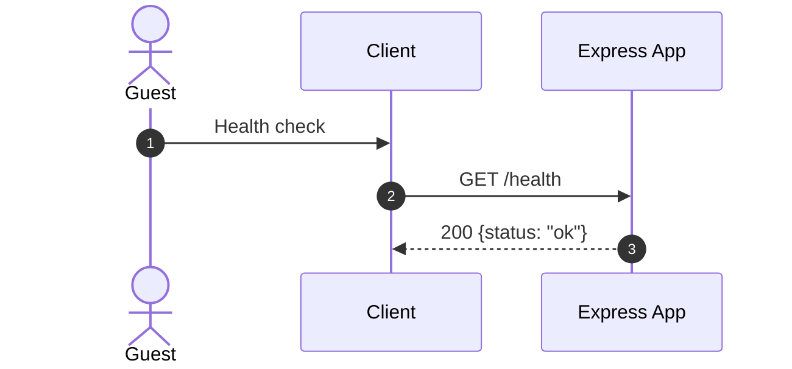
```mermaid
sequenceDiagram
    autonumber
    actor U as Guest
    participant FE as Client
    participant APP as Express App

    U->>FE: Health check
    FE->>APP: GET /health
    APP-->>FE: 200 {status: "ok"}
```

### 1.2 Xem du lieu catalog public

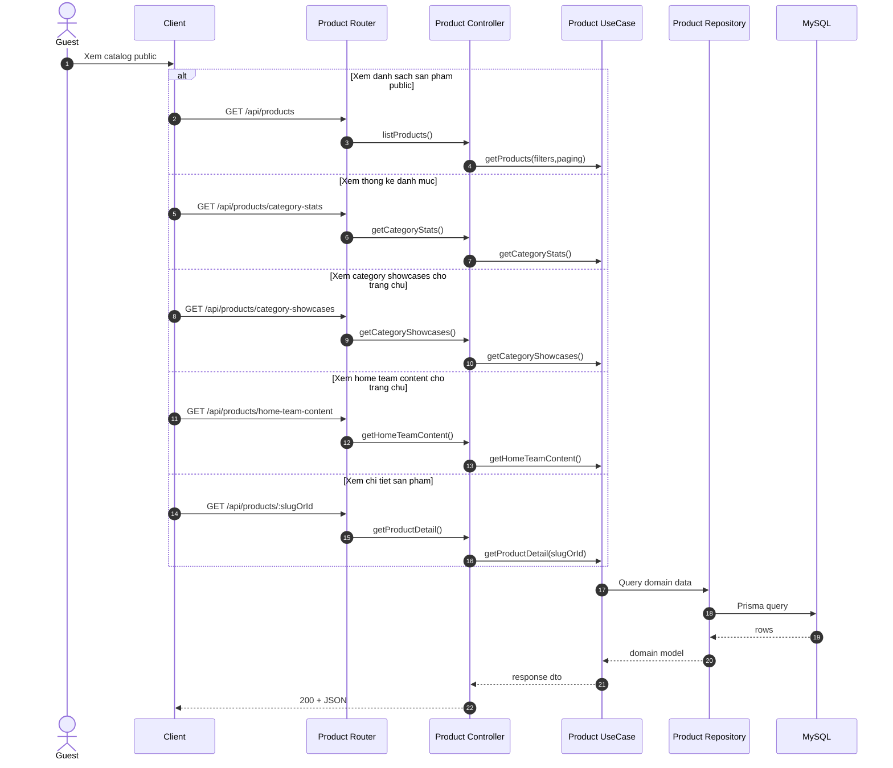
```mermaid
sequenceDiagram
    autonumber
    actor U as Guest
    participant FE as Client
    participant R as Product Router
    participant CTL as Product Controller
    participant UC as Product UseCase
    participant REPO as Product Repository
    participant DB as MySQL

    U->>FE: Xem catalog public

    alt Xem danh sach san pham public
        FE->>R: GET /api/products
        R->>CTL: listProducts()
        CTL->>UC: getProducts(filters,paging)
    else Xem thong ke danh muc
        FE->>R: GET /api/products/category-stats
        R->>CTL: getCategoryStats()
        CTL->>UC: getCategoryStats()
    else Xem category showcases cho trang chu
        FE->>R: GET /api/products/category-showcases
        R->>CTL: getCategoryShowcases()
        CTL->>UC: getCategoryShowcases()
    else Xem home team content cho trang chu
        FE->>R: GET /api/products/home-team-content
        R->>CTL: getHomeTeamContent()
        CTL->>UC: getHomeTeamContent()
    else Xem chi tiet san pham
        FE->>R: GET /api/products/:slugOrId
        R->>CTL: getProductDetail()
        CTL->>UC: getProductDetail(slugOrId)
    end

    UC->>REPO: Query domain data
    REPO->>DB: Prisma query
    DB-->>REPO: rows
    REPO-->>UC: domain model
    UC-->>CTL: response dto
    CTL-->>FE: 200 + JSON
```

### 1.3 Xem du lieu dung chung

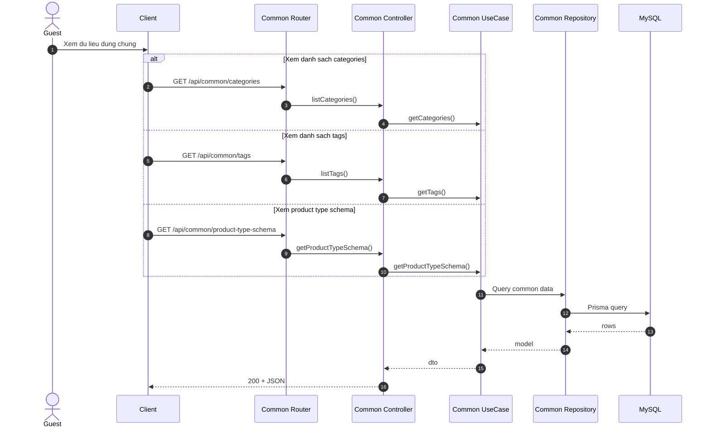
```mermaid
sequenceDiagram
    autonumber
    actor U as Guest
    participant FE as Client
    participant R as Common Router
    participant CTL as Common Controller
    participant UC as Common UseCase
    participant REPO as Common Repository
    participant DB as MySQL

    U->>FE: Xem du lieu dung chung

    alt Xem danh sach categories
        FE->>R: GET /api/common/categories
        R->>CTL: listCategories()
        CTL->>UC: getCategories()
    else Xem danh sach tags
        FE->>R: GET /api/common/tags
        R->>CTL: listTags()
        CTL->>UC: getTags()
    else Xem product type schema
        FE->>R: GET /api/common/product-type-schema
        R->>CTL: getProductTypeSchema()
        CTL->>UC: getProductTypeSchema()
    end

    UC->>REPO: Query common data
    REPO->>DB: Prisma query
    DB-->>REPO: rows
    REPO-->>UC: model
    UC-->>CTL: dto
    CTL-->>FE: 200 + JSON
```

### 1.4 Xem banner, voucher, dia diem (public)

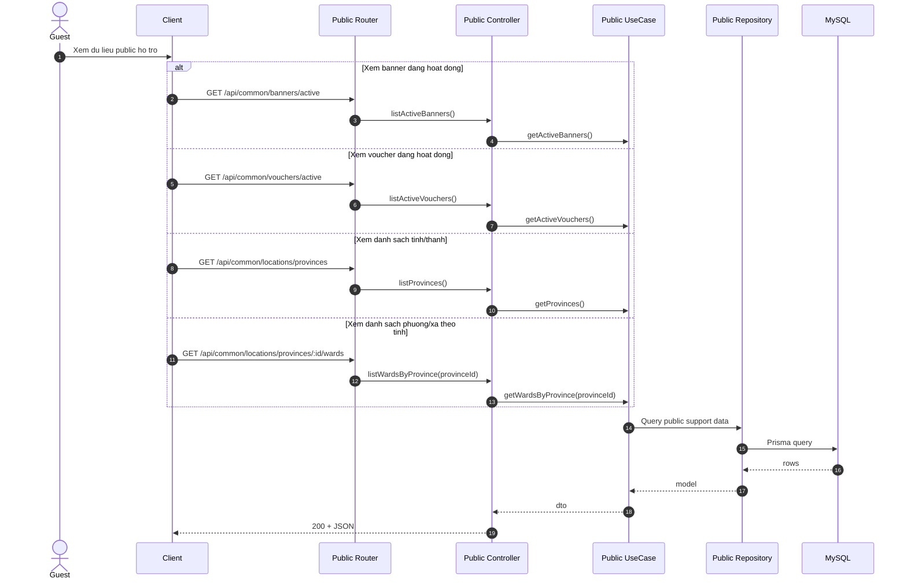
```mermaid
sequenceDiagram
    autonumber
    actor U as Guest
    participant FE as Client
    participant R as Public Router
    participant CTL as Public Controller
    participant UC as Public UseCase
    participant REPO as Public Repository
    participant DB as MySQL

    U->>FE: Xem du lieu public ho tro

    alt Xem banner dang hoat dong
        FE->>R: GET /api/common/banners/active
        R->>CTL: listActiveBanners()
        CTL->>UC: getActiveBanners()
    else Xem voucher dang hoat dong
        FE->>R: GET /api/common/vouchers/active
        R->>CTL: listActiveVouchers()
        CTL->>UC: getActiveVouchers()
    else Xem danh sach tinh/thanh
        FE->>R: GET /api/common/locations/provinces
        R->>CTL: listProvinces()
        CTL->>UC: getProvinces()
    else Xem danh sach phuong/xa theo tinh
        FE->>R: GET /api/common/locations/provinces/:id/wards
        R->>CTL: listWardsByProvince(provinceId)
        CTL->>UC: getWardsByProvince(provinceId)
    end

    UC->>REPO: Query public support data
    REPO->>DB: Prisma query
    DB-->>REPO: rows
    REPO-->>UC: model
    UC-->>CTL: dto
    CTL-->>FE: 200 + JSON
```

## 2. Nguoi dung da dang nhap (Buyer)

### 2.0 Auth gate chung cho API private

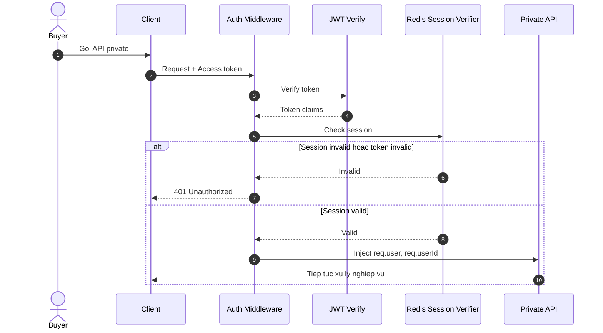
```mermaid
sequenceDiagram
    autonumber
    actor U as Buyer
    participant FE as Client
    participant AUTH as Auth Middleware
    participant JWT as JWT Verify
    participant REDIS as Redis Session Verifier
    participant API as Private API

    U->>FE: Goi API private
    FE->>AUTH: Request + Access token
    AUTH->>JWT: Verify token
    JWT-->>AUTH: Token claims
    AUTH->>REDIS: Check session

    alt Session invalid hoac token invalid
        REDIS-->>AUTH: Invalid
        AUTH-->>FE: 401 Unauthorized
    else Session valid
        REDIS-->>AUTH: Valid
        AUTH->>API: Inject req.user, req.userId
        API-->>FE: Tiep tuc xu ly nghiep vu
    end
```

### 2.1 Dang nhap (nhieu cach)

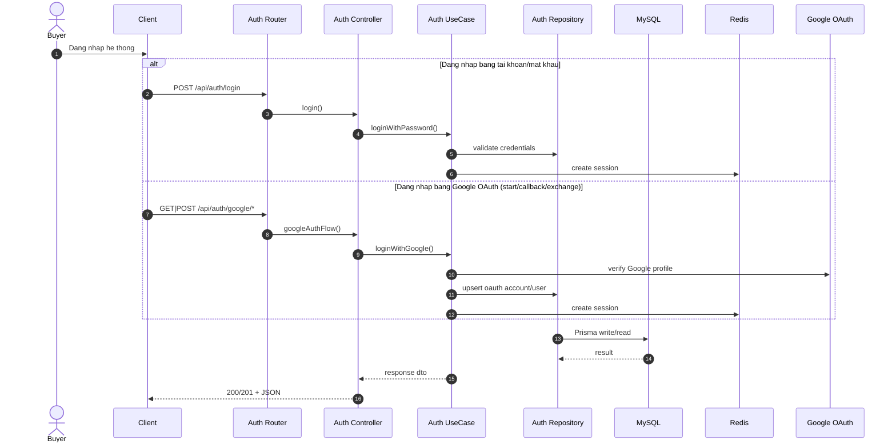
```mermaid
sequenceDiagram
    autonumber
    actor U as Buyer
    participant FE as Client
    participant R as Auth Router
    participant CTL as Auth Controller
    participant UC as Auth UseCase
    participant REPO as Auth Repository
    participant DB as MySQL
    participant REDIS as Redis
    participant EXT as Google OAuth

    U->>FE: Dang nhap he thong

    alt Dang nhap bang tai khoan/mat khau
        FE->>R: POST /api/auth/login
        R->>CTL: login()
        CTL->>UC: loginWithPassword()
        UC->>REPO: validate credentials
        UC->>REDIS: create session
    else Dang nhap bang Google OAuth (start/callback/exchange)
        FE->>R: GET|POST /api/auth/google/*
        R->>CTL: googleAuthFlow()
        CTL->>UC: loginWithGoogle()
        UC->>EXT: verify Google profile
        UC->>REPO: upsert oauth account/user
        UC->>REDIS: create session
    end

    REPO->>DB: Prisma write/read
    DB-->>REPO: result
    UC-->>CTL: response dto
    CTL-->>FE: 200/201 + JSON
```

### 2.1b Dang ky tai khoan

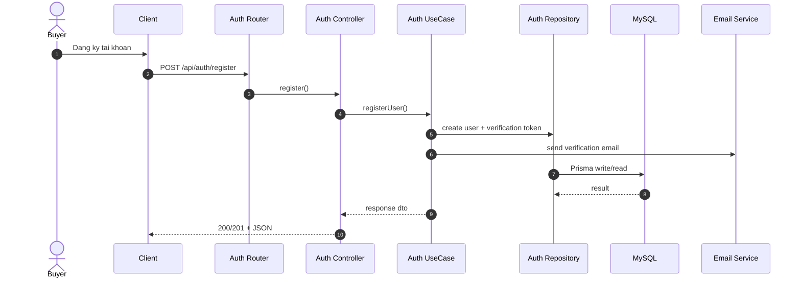
```mermaid
sequenceDiagram
    autonumber
    actor U as Buyer
    participant FE as Client
    participant R as Auth Router
    participant CTL as Auth Controller
    participant UC as Auth UseCase
    participant REPO as Auth Repository
    participant DB as MySQL
    participant EXT as Email Service

    U->>FE: Dang ky tai khoan
    FE->>R: POST /api/auth/register
    R->>CTL: register()
    CTL->>UC: registerUser()
    UC->>REPO: create user + verification token
    UC->>EXT: send verification email

    REPO->>DB: Prisma write/read
    DB-->>REPO: result
    UC-->>CTL: response dto
    CTL-->>FE: 200/201 + JSON
```

### 2.1c Xac minh email

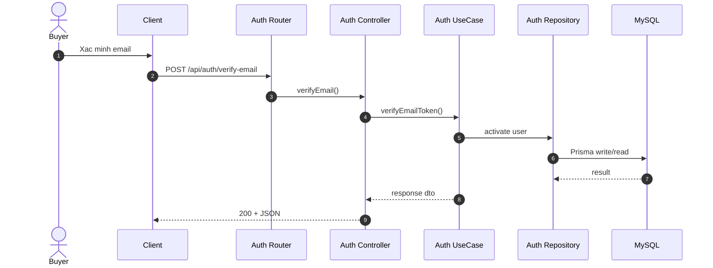
```mermaid
sequenceDiagram
    autonumber
    actor U as Buyer
    participant FE as Client
    participant R as Auth Router
    participant CTL as Auth Controller
    participant UC as Auth UseCase
    participant REPO as Auth Repository
    participant DB as MySQL

    U->>FE: Xac minh email
    FE->>R: POST /api/auth/verify-email
    R->>CTL: verifyEmail()
    CTL->>UC: verifyEmailToken()
    UC->>REPO: activate user
    REPO->>DB: Prisma write/read
    DB-->>REPO: result
    UC-->>CTL: response dto
    CTL-->>FE: 200 + JSON
```

### 2.1d Lam moi token (refresh token)

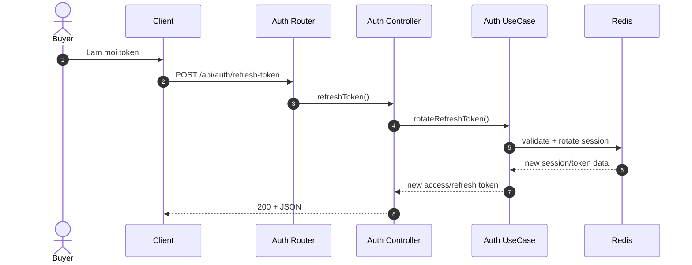
```mermaid
sequenceDiagram
    autonumber
    actor U as Buyer
    participant FE as Client
    participant R as Auth Router
    participant CTL as Auth Controller
    participant UC as Auth UseCase
    participant REDIS as Redis

    U->>FE: Lam moi token
    FE->>R: POST /api/auth/refresh-token
    R->>CTL: refreshToken()
    CTL->>UC: rotateRefreshToken()
    UC->>REDIS: validate + rotate session
    REDIS-->>UC: new session/token data
    UC-->>CTL: new access/refresh token
    CTL-->>FE: 200 + JSON
```

### 2.1e Dang xuat

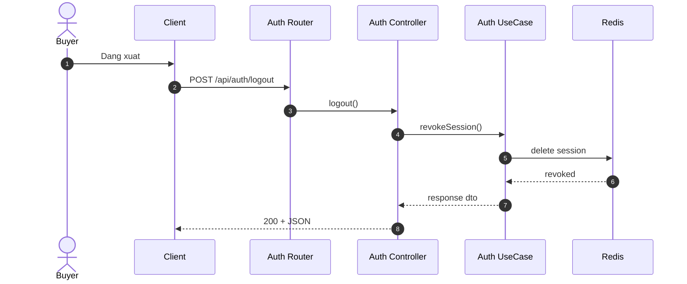
```mermaid
sequenceDiagram
    autonumber
    actor U as Buyer
    participant FE as Client
    participant R as Auth Router
    participant CTL as Auth Controller
    participant UC as Auth UseCase
    participant REDIS as Redis

    U->>FE: Dang xuat
    FE->>R: POST /api/auth/logout
    R->>CTL: logout()
    CTL->>UC: revokeSession()
    UC->>REDIS: delete session
    REDIS-->>UC: revoked
    UC-->>CTL: response dto
    CTL-->>FE: 200 + JSON
```

### 2.1f Phuc hoi mat khau

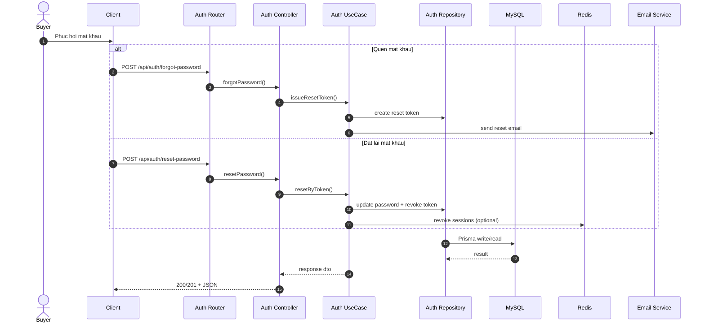
```mermaid
sequenceDiagram
    autonumber
    actor U as Buyer
    participant FE as Client
    participant R as Auth Router
    participant CTL as Auth Controller
    participant UC as Auth UseCase
    participant REPO as Auth Repository
    participant DB as MySQL
    participant REDIS as Redis
    participant EXT as Email Service

    U->>FE: Phuc hoi mat khau

    alt Quen mat khau
        FE->>R: POST /api/auth/forgot-password
        R->>CTL: forgotPassword()
        CTL->>UC: issueResetToken()
        UC->>REPO: create reset token
        UC->>EXT: send reset email
    else Dat lai mat khau
        FE->>R: POST /api/auth/reset-password
        R->>CTL: resetPassword()
        CTL->>UC: resetByToken()
        UC->>REPO: update password + revoke token
        UC->>REDIS: revoke sessions (optional)
    end

    REPO->>DB: Prisma write/read
    DB-->>REPO: result
    UC-->>CTL: response dto
    CTL-->>FE: 200/201 + JSON
```

### 2.2 Dia chi giao hang

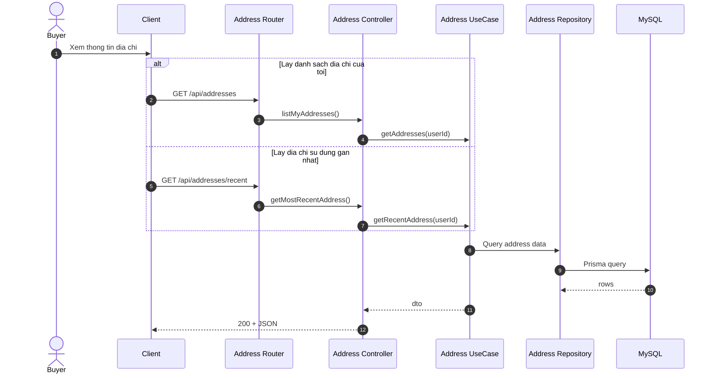
```mermaid
sequenceDiagram
    autonumber
    actor U as Buyer
    participant FE as Client
    participant R as Address Router
    participant CTL as Address Controller
    participant UC as Address UseCase
    participant REPO as Address Repository
    participant DB as MySQL

    U->>FE: Xem thong tin dia chi

    alt Lay danh sach dia chi cua toi
        FE->>R: GET /api/addresses
        R->>CTL: listMyAddresses()
        CTL->>UC: getAddresses(userId)
    else Lay dia chi su dung gan nhat
        FE->>R: GET /api/addresses/recent
        R->>CTL: getMostRecentAddress()
        CTL->>UC: getRecentAddress(userId)
    end

    UC->>REPO: Query address data
    REPO->>DB: Prisma query
    DB-->>REPO: rows
    UC-->>CTL: dto
    CTL-->>FE: 200 + JSON
```

### 2.3 Wishlist / Favorites

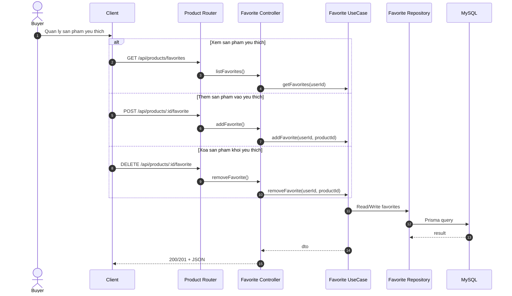
```mermaid
sequenceDiagram
    autonumber
    actor U as Buyer
    participant FE as Client
    participant R as Product Router
    participant CTL as Favorite Controller
    participant UC as Favorite UseCase
    participant REPO as Favorite Repository
    participant DB as MySQL

    U->>FE: Quan ly san pham yeu thich

    alt Xem san pham yeu thich
        FE->>R: GET /api/products/favorites
        R->>CTL: listFavorites()
        CTL->>UC: getFavorites(userId)
    else Them san pham vao yeu thich
        FE->>R: POST /api/products/:id/favorite
        R->>CTL: addFavorite()
        CTL->>UC: addFavorite(userId, productId)
    else Xoa san pham khoi yeu thich
        FE->>R: DELETE /api/products/:id/favorite
        R->>CTL: removeFavorite()
        CTL->>UC: removeFavorite(userId, productId)
    end

    UC->>REPO: Read/Write favorites
    REPO->>DB: Prisma query
    DB-->>REPO: result
    UC-->>CTL: dto
    CTL-->>FE: 200/201 + JSON
```

### 2.4 Gio hang

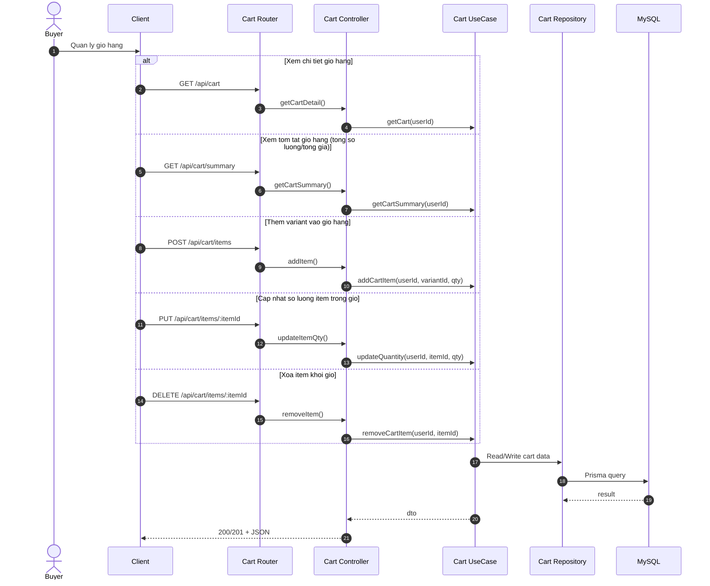
```mermaid
sequenceDiagram
    autonumber
    actor U as Buyer
    participant FE as Client
    participant R as Cart Router
    participant CTL as Cart Controller
    participant UC as Cart UseCase
    participant REPO as Cart Repository
    participant DB as MySQL

    U->>FE: Quan ly gio hang

    alt Xem chi tiet gio hang
        FE->>R: GET /api/cart
        R->>CTL: getCartDetail()
        CTL->>UC: getCart(userId)
    else Xem tom tat gio hang (tong so luong/tong gia)
        FE->>R: GET /api/cart/summary
        R->>CTL: getCartSummary()
        CTL->>UC: getCartSummary(userId)
    else Them variant vao gio hang
        FE->>R: POST /api/cart/items
        R->>CTL: addItem()
        CTL->>UC: addCartItem(userId, variantId, qty)
    else Cap nhat so luong item trong gio
        FE->>R: PUT /api/cart/items/:itemId
        R->>CTL: updateItemQty()
        CTL->>UC: updateQuantity(userId, itemId, qty)
    else Xoa item khoi gio
        FE->>R: DELETE /api/cart/items/:itemId
        R->>CTL: removeItem()
        CTL->>UC: removeCartItem(userId, itemId)
    end

    UC->>REPO: Read/Write cart data
    REPO->>DB: Prisma query
    DB-->>REPO: result
    UC-->>CTL: dto
    CTL-->>FE: 200/201 + JSON
```

### 2.5 Voucher private

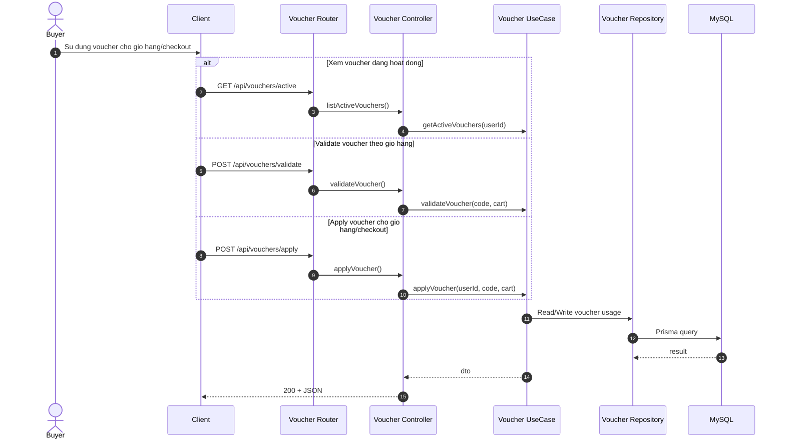
```mermaid
sequenceDiagram
    autonumber
    actor U as Buyer
    participant FE as Client
    participant R as Voucher Router
    participant CTL as Voucher Controller
    participant UC as Voucher UseCase
    participant REPO as Voucher Repository
    participant DB as MySQL

    U->>FE: Su dung voucher cho gio hang/checkout

    alt Xem voucher dang hoat dong
        FE->>R: GET /api/vouchers/active
        R->>CTL: listActiveVouchers()
        CTL->>UC: getActiveVouchers(userId)
    else Validate voucher theo gio hang
        FE->>R: POST /api/vouchers/validate
        R->>CTL: validateVoucher()
        CTL->>UC: validateVoucher(code, cart)
    else Apply voucher cho gio hang/checkout
        FE->>R: POST /api/vouchers/apply
        R->>CTL: applyVoucher()
        CTL->>UC: applyVoucher(userId, code, cart)
    end

    UC->>REPO: Read/Write voucher usage
    REPO->>DB: Prisma query
    DB-->>REPO: result
    UC-->>CTL: dto
    CTL-->>FE: 200 + JSON
```

### 2.6 Don hang cua toi

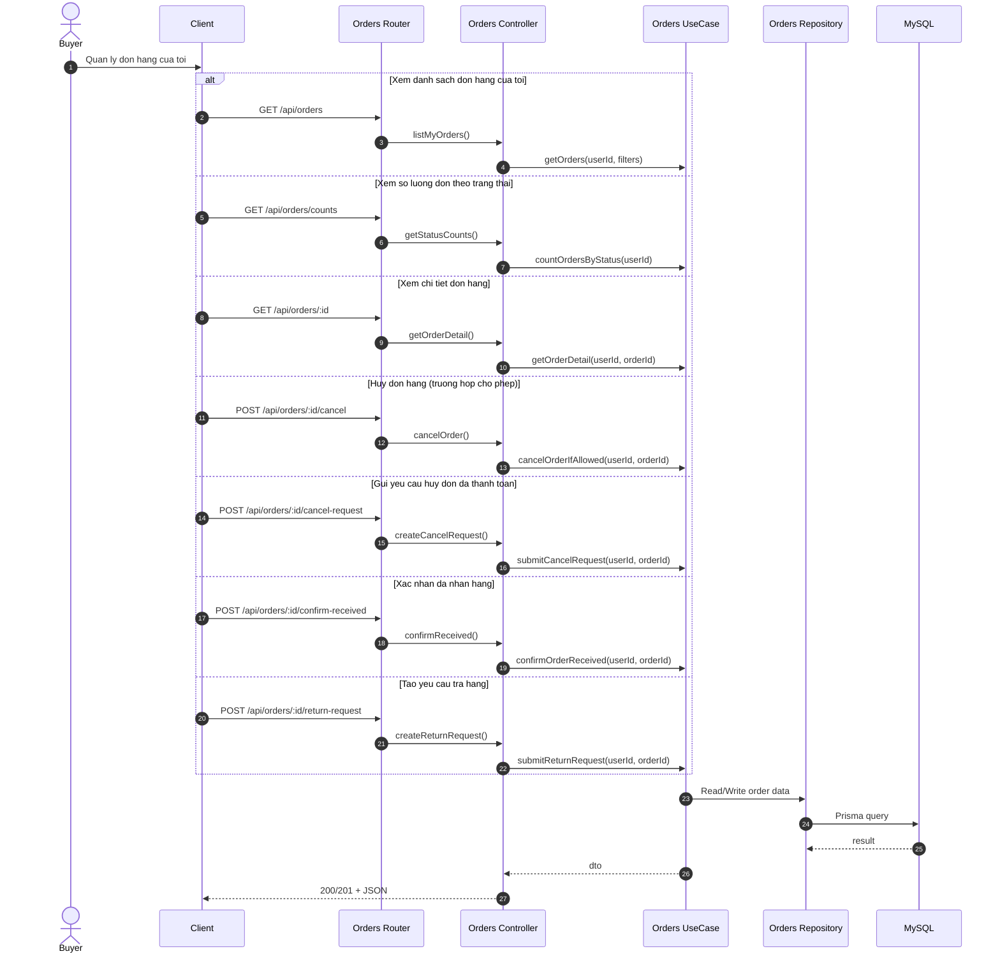
```mermaid
sequenceDiagram
    autonumber
    actor U as Buyer
    participant FE as Client
    participant R as Orders Router
    participant CTL as Orders Controller
    participant UC as Orders UseCase
    participant REPO as Orders Repository
    participant DB as MySQL

    U->>FE: Quan ly don hang cua toi

    alt Xem danh sach don hang cua toi
        FE->>R: GET /api/orders
        R->>CTL: listMyOrders()
        CTL->>UC: getOrders(userId, filters)
    else Xem so luong don theo trang thai
        FE->>R: GET /api/orders/counts
        R->>CTL: getStatusCounts()
        CTL->>UC: countOrdersByStatus(userId)
    else Xem chi tiet don hang
        FE->>R: GET /api/orders/:id
        R->>CTL: getOrderDetail()
        CTL->>UC: getOrderDetail(userId, orderId)
    else Huy don hang (truong hop cho phep)
        FE->>R: POST /api/orders/:id/cancel
        R->>CTL: cancelOrder()
        CTL->>UC: cancelOrderIfAllowed(userId, orderId)
    else Gui yeu cau huy don da thanh toan
        FE->>R: POST /api/orders/:id/cancel-request
        R->>CTL: createCancelRequest()
        CTL->>UC: submitCancelRequest(userId, orderId)
    else Xac nhan da nhan hang
        FE->>R: POST /api/orders/:id/confirm-received
        R->>CTL: confirmReceived()
        CTL->>UC: confirmOrderReceived(userId, orderId)
    else Tao yeu cau tra hang
        FE->>R: POST /api/orders/:id/return-request
        R->>CTL: createReturnRequest()
        CTL->>UC: submitReturnRequest(userId, orderId)
    end

    UC->>REPO: Read/Write order data
    REPO->>DB: Prisma query
    DB-->>REPO: result
    UC-->>CTL: dto
    CTL-->>FE: 200/201 + JSON
```

### 2.7 Thong bao cua toi

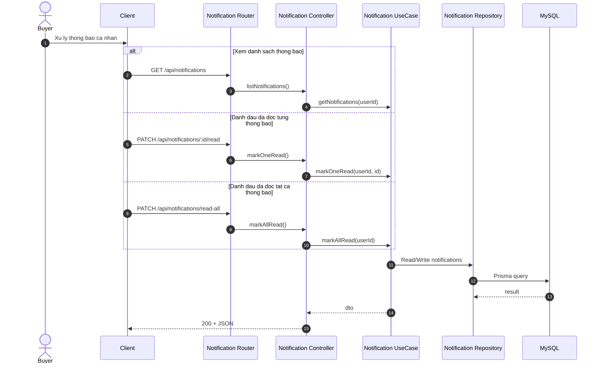
```mermaid
sequenceDiagram
    autonumber
    actor U as Buyer
    participant FE as Client
    participant R as Notification Router
    participant CTL as Notification Controller
    participant UC as Notification UseCase
    participant REPO as Notification Repository
    participant DB as MySQL

    U->>FE: Xu ly thong bao ca nhan

    alt Xem danh sach thong bao
        FE->>R: GET /api/notifications
        R->>CTL: listNotifications()
        CTL->>UC: getNotifications(userId)
    else Danh dau da doc tung thong bao
        FE->>R: PATCH /api/notifications/:id/read
        R->>CTL: markOneRead()
        CTL->>UC: markOneRead(userId, id)
    else Danh dau da doc tat ca thong bao
        FE->>R: PATCH /api/notifications/read-all
        R->>CTL: markAllRead()
        CTL->>UC: markAllRead(userId)
    end

    UC->>REPO: Read/Write notifications
    REPO->>DB: Prisma query
    DB-->>REPO: result
    UC-->>CTL: dto
    CTL-->>FE: 200 + JSON
```

### 2.8 Danh gia san pham

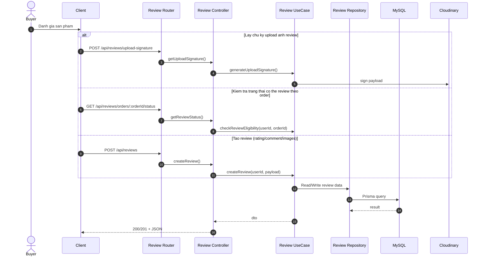
```mermaid
sequenceDiagram
    autonumber
    actor U as Buyer
    participant FE as Client
    participant R as Review Router
    participant CTL as Review Controller
    participant UC as Review UseCase
    participant REPO as Review Repository
    participant DB as MySQL
    participant CLOUD as Cloudinary

    U->>FE: Danh gia san pham

    alt Lay chu ky upload anh review
        FE->>R: POST /api/reviews/upload-signature
        R->>CTL: getUploadSignature()
        CTL->>UC: generateUploadSignature()
        UC->>CLOUD: sign payload
    else Kiem tra trang thai co the review theo order
        FE->>R: GET /api/reviews/orders/:orderId/status
        R->>CTL: getReviewStatus()
        CTL->>UC: checkReviewEligibility(userId, orderId)
    else Tao review (rating/comment/images)
        FE->>R: POST /api/reviews
        R->>CTL: createReview()
        CTL->>UC: createReview(userId, payload)
    end

    UC->>REPO: Read/Write review data
    REPO->>DB: Prisma query
    DB-->>REPO: result
    UC-->>CTL: dto
    CTL-->>FE: 200/201 + JSON
```

### 2.9 Thanh toan PayOS

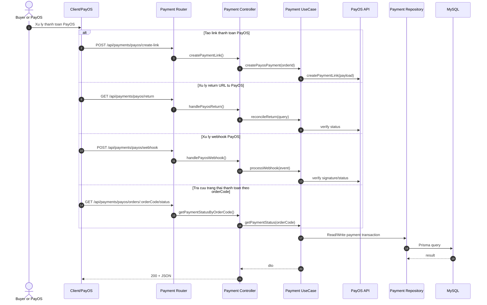
```mermaid
sequenceDiagram
    autonumber
    actor U as Buyer or PayOS
    participant FE as Client/PayOS
    participant R as Payment Router
    participant CTL as Payment Controller
    participant UC as Payment UseCase
    participant PAYOS as PayOS API
    participant REPO as Payment Repository
    participant DB as MySQL

    U->>FE: Xu ly thanh toan PayOS

    alt Tao link thanh toan PayOS
        FE->>R: POST /api/payments/payos/create-link
        R->>CTL: createPaymentLink()
        CTL->>UC: createPayosPayment(orderId)
        UC->>PAYOS: createPaymentLink(payload)
    else Xu ly return URL tu PayOS
        FE->>R: GET /api/payments/payos/return
        R->>CTL: handlePayosReturn()
        CTL->>UC: reconcileReturn(query)
        UC->>PAYOS: verify status
    else Xu ly webhook PayOS
        FE->>R: POST /api/payments/payos/webhook
        R->>CTL: handlePayosWebhook()
        CTL->>UC: processWebhook(event)
        UC->>PAYOS: verify signature/status
    else Tra cuu trang thai thanh toan theo orderCode
        FE->>R: GET /api/payments/payos/orders/:orderCode/status
        R->>CTL: getPaymentStatusByOrderCode()
        CTL->>UC: getPaymentStatus(orderCode)
    end

    UC->>REPO: Read/Write payment transaction
    REPO->>DB: Prisma query
    DB-->>REPO: result
    UC-->>CTL: dto
    CTL-->>FE: 200 + JSON
```

## 3. Admin

### 3.0 Gate chung cho Admin API

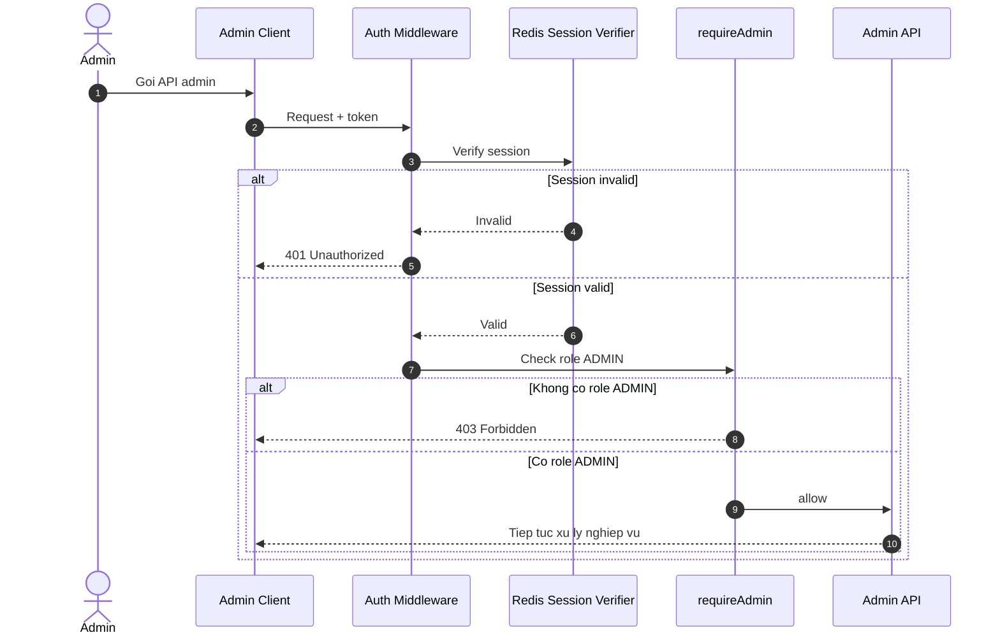
```mermaid
sequenceDiagram
    autonumber
    actor A as Admin
    participant FE as Admin Client
    participant AUTH as Auth Middleware
    participant REDIS as Redis Session Verifier
    participant RBAC as requireAdmin
    participant API as Admin API

    A->>FE: Goi API admin
    FE->>AUTH: Request + token
    AUTH->>REDIS: Verify session

    alt Session invalid
        REDIS-->>AUTH: Invalid
        AUTH-->>FE: 401 Unauthorized
    else Session valid
        REDIS-->>AUTH: Valid
        AUTH->>RBAC: Check role ADMIN
        alt Khong co role ADMIN
            RBAC-->>FE: 403 Forbidden
        else Co role ADMIN
            RBAC->>API: allow
            API-->>FE: Tiep tuc xu ly nghiep vu
        end
    end
```

### 3.1 Dang nhap admin

```mermaid
sequenceDiagram
    autonumber
    actor A as Admin Candidate
    participant FE as Admin Client
    participant R as AdminAuth Router
    participant CTL as AdminAuth Controller
    participant UC as AdminAuth UseCase
    participant REPO as User Repository
    participant DB as MySQL
    participant REDIS as Redis

    A->>FE: Dang nhap admin
    FE->>R: POST /api/admin/auth/login
    R->>CTL: loginAdmin()
    CTL->>UC: loginAsAdmin(credentials)
    UC->>REPO: validate credentials + role ADMIN
    REPO->>DB: Prisma query
    DB-->>REPO: user/role row
    UC->>REDIS: create admin session
    REDIS-->>UC: session
    UC-->>CTL: token pair
    CTL-->>FE: 200 + JSON
```

### 3.2 Quan tri san pham

```mermaid
sequenceDiagram
    autonumber
    actor A as Admin
    participant FE as Admin Client
    participant R as AdminProduct Router
    participant CTL as AdminProduct Controller
    participant UC as AdminProduct UseCase
    participant REPO as Product Repository
    participant DB as MySQL
    participant CSV as CSV Exporter

    A->>FE: Quan tri san pham

    alt Xem danh sach san pham admin
        FE->>R: GET /api/admin/products
        R->>CTL: listProducts()
        CTL->>UC: getAdminProducts(filters,paging)
    else Export danh sach san pham ra CSV
        FE->>R: GET /api/admin/products/export
        R->>CTL: exportProductsCsv()
        CTL->>UC: getProductsForExport()
        UC->>CSV: build csv
    else Xem chi tiet san pham
        FE->>R: GET /api/admin/products/:id
        R->>CTL: getProductDetail()
        CTL->>UC: getProductDetail(id)
    else Tao san pham
        FE->>R: POST /api/admin/products
        R->>CTL: createProduct()
        CTL->>UC: createProduct(payload)
    else Cap nhat san pham
        FE->>R: PUT /api/admin/products/:id
        R->>CTL: updateProduct()
        CTL->>UC: updateProduct(id,payload)
    else Xoa mem san pham
        FE->>R: DELETE /api/admin/products/:id
        R->>CTL: softDeleteProduct()
        CTL->>UC: softDeleteProduct(id)
    else Khoi phuc san pham da xoa
        FE->>R: POST /api/admin/products/:id/restore
        R->>CTL: restoreProduct()
        CTL->>UC: restoreProduct(id)
    else Xoa hang loat san pham
        FE->>R: POST /api/admin/products/bulk-delete
        R->>CTL: bulkDeleteProducts()
        CTL->>UC: bulkSoftDelete(productIds)
    end

    UC->>REPO: Read/Write product data
    REPO->>DB: Prisma query
    DB-->>REPO: result
    UC-->>CTL: dto
    CTL-->>FE: 200/201 + JSON/CSV
```

### 3.3 Quan tri bien the va ton kho

```mermaid
sequenceDiagram
    autonumber
    actor A as Admin
    participant FE as Admin Client
    participant R as AdminVariantInventory Router
    participant CTL as AdminVariantInventory Controller
    participant UC as AdminVariantInventory UseCase
    participant REPO as VariantInventory Repository
    participant DB as MySQL

    A->>FE: Quan tri bien the va ton kho

    alt Tao variant cho san pham
        FE->>R: POST /api/admin/products/:id/variants
        R->>CTL: createVariant()
        CTL->>UC: createVariant(productId,payload)
    else Cap nhat variant
        FE->>R: PUT /api/admin/products/variants/:variantId
        R->>CTL: updateVariant()
        CTL->>UC: updateVariant(variantId,payload)
    else Xoa variant
        FE->>R: DELETE /api/admin/products/variants/:variantId
        R->>CTL: deleteVariant()
        CTL->>UC: deleteVariant(variantId)
    else Dieu chinh ton kho variant
        FE->>R: POST /api/admin/products/inventory/adjust
        R->>CTL: adjustInventory()
        CTL->>UC: adjustInventory(variantId,qty,type)
    else Xem lich su bien dong ton kho
        FE->>R: GET /api/admin/products/inventory/logs
        R->>CTL: listInventoryLogs()
        CTL->>UC: getInventoryLogs(filters)
    end

    UC->>REPO: Read/Write variant-inventory data
    REPO->>DB: Prisma query
    DB-->>REPO: result
    CTL-->>FE: 200/201 + JSON
```

### 3.4 Quan tri category/tag va tac vu hang loat

```mermaid
sequenceDiagram
    autonumber
    actor A as Admin
    participant FE as Admin Client
    participant R as AdminCategoryTag Router
    participant CTL as AdminCategoryTag Controller
    participant UC as AdminCategoryTag UseCase
    participant REPO as CategoryTag Repository
    participant DB as MySQL

    A->>FE: Quan tri category/tag

    alt Xem categories de gan cho san pham
        FE->>R: GET /api/admin/products/categories
        R->>CTL: listCategories()
        CTL->>UC: getCategoriesForAssign()
    else Xem tags de gan cho san pham
        FE->>R: GET /api/admin/products/tags
        R->>CTL: listTags()
        CTL->>UC: getTagsForAssign()
    else Gan category hang loat (append/replace)
        FE->>R: POST /api/admin/products/bulk-assign-categories
        R->>CTL: bulkAssignCategories()
        CTL->>UC: assignCategories(mode,productIds,categoryIds)
    else Gan tag hang loat (append/replace)
        FE->>R: POST /api/admin/products/bulk-assign-tags
        R->>CTL: bulkAssignTags()
        CTL->>UC: assignTags(mode,productIds,tagIds)
    end

    UC->>REPO: Read/Write category-tag mapping
    REPO->>DB: Prisma query
    DB-->>REPO: result
    CTL-->>FE: 200 + JSON
```

### 3.5 Quan tri media san pham

```mermaid
sequenceDiagram
    autonumber
    actor A as Admin
    participant FE as Admin Client
    participant R as AdminUpload Router
    participant CTL as AdminUpload Controller
    participant UC as AdminUpload UseCase
    participant CLOUD as Cloudinary
    participant REPO as ProductMedia Repository
    participant DB as MySQL

    A->>FE: Quan tri media san pham

    alt Tao chu ky upload anh
        FE->>R: POST /api/admin/products/upload/signature
        R->>CTL: getUploadSignature()
        CTL->>UC: generateUploadSignature()
        UC->>CLOUD: sign payload
    else Luu anh san pham/anh variant
        FE->>R: POST /api/admin/products/upload/save
        R->>CTL: saveMedia()
        CTL->>UC: saveMediaRef(payload)
    else Xoa anh san pham
        FE->>R: DELETE /api/admin/products/upload/:imageId
        R->>CTL: deleteMedia()
        CTL->>UC: deleteMedia(imageId)
        UC->>CLOUD: delete asset
    end

    UC->>REPO: Read/Write media data
    REPO->>DB: Prisma query
    DB-->>REPO: result
    CTL-->>FE: 200/201 + JSON
```

### 3.6 Analytics san pham

```mermaid
sequenceDiagram
    autonumber
    actor A as Admin
    participant FE as Admin Client
    participant R as AdminProductAnalytics Router
    participant CTL as AdminProductAnalytics Controller
    participant UC as AdminProductAnalytics UseCase
    participant REPO as ProductAnalytics Repository
    participant DB as MySQL

    A->>FE: Xem analytics san pham

    alt Xem top san pham ban chay
        FE->>R: GET /api/admin/products/analytics/top-selling
        R->>CTL: getTopSelling()
        CTL->>UC: getTopSelling()
    else Xem top san pham duoc yeu thich
        FE->>R: GET /api/admin/products/analytics/top-favorited
        R->>CTL: getTopFavorited()
        CTL->>UC: getTopFavorited()
    else Xem san pham it duoc mua
        FE->>R: GET /api/admin/products/analytics/least-purchased
        R->>CTL: getLeastPurchased()
        CTL->>UC: getLeastPurchased()
    end

    UC->>REPO: Aggregate analytics query
    REPO->>DB: Prisma aggregate
    DB-->>REPO: rows
    CTL-->>FE: 200 + JSON
```

### 3.7 Quan tri don hang

```mermaid
sequenceDiagram
    autonumber
    actor A as Admin
    participant FE as Admin Client
    participant R as AdminOrders Router
    participant CTL as AdminOrders Controller
    participant UC as AdminOrders UseCase
    participant REPO as Orders Repository
    participant DB as MySQL
    participant CSV as CSV Exporter

    A->>FE: Quan tri don hang

    alt Xem danh sach don hang
        FE->>R: GET /api/admin/orders
        R->>CTL: listOrders()
        CTL->>UC: getOrders(filters,paging)
    else Export don hang
        FE->>R: GET /api/admin/orders/export
        R->>CTL: exportOrdersCsv()
        CTL->>UC: getOrdersForExport()
        UC->>CSV: build csv
    else Xem counts don hang theo trang thai
        FE->>R: GET /api/admin/orders/counts
        R->>CTL: getOrderCounts()
        CTL->>UC: getOrderCounts()
    else Xem analytics trang thai don hang
        FE->>R: GET /api/admin/orders/analytics/status
        R->>CTL: getStatusAnalytics()
        CTL->>UC: getStatusAnalytics()
    else Xem analytics timeseries don hang
        FE->>R: GET /api/admin/orders/analytics/timeseries
        R->>CTL: getTimeseriesAnalytics()
        CTL->>UC: getTimeseriesAnalytics()
    else Huy don hang boi admin
        FE->>R: POST /api/admin/orders/:id/cancel
        R->>CTL: cancelOrderByAdmin()
        CTL->>UC: cancelOrder(orderId)
    else Kiem tra kha nang xac nhan don
        FE->>R: GET /api/admin/orders/:id/can-confirm
        R->>CTL: canConfirmOrder()
        CTL->>UC: canConfirm(orderId)
    else Xac nhan don
        FE->>R: POST /api/admin/orders/:id/confirm
        R->>CTL: confirmOrder()
        CTL->>UC: confirmOrder(orderId)
    else Chuyen don sang dang giao (ship)
        FE->>R: POST /api/admin/orders/:id/ship
        R->>CTL: shipOrder()
        CTL->>UC: shipOrder(orderId)
    else Danh dau da giao (deliver)
        FE->>R: POST /api/admin/orders/:id/deliver
        R->>CTL: deliverOrder()
        CTL->>UC: deliverOrder(orderId)
    end

    UC->>REPO: Read/Write order data
    REPO->>DB: Prisma query
    DB-->>REPO: result
    CTL-->>FE: 200 + JSON/CSV
```

### 3.8 Quan tri yeu cau huy don da thanh toan

```mermaid
sequenceDiagram
    autonumber
    actor A as Admin
    participant FE as Admin Client
    participant R as AdminOrders Router
    participant CTL as AdminOrders Controller
    participant UC as CancelRequest UseCase
    participant REPO as CancelRequest Repository
    participant DB as MySQL

    A->>FE: Xu ly yeu cau huy don da thanh toan

    alt Duyet yeu cau huy don
        FE->>R: POST /api/admin/orders/cancel-requests/:id/approve
        R->>CTL: approveCancelRequest()
        CTL->>UC: approveCancelRequest(id)
    else Tu choi yeu cau huy don
        FE->>R: POST /api/admin/orders/cancel-requests/:id/reject
        R->>CTL: rejectCancelRequest()
        CTL->>UC: rejectCancelRequest(id,reason)
    else Hoan tat hoan tien cho yeu cau huy don
        FE->>R: POST /api/admin/orders/cancel-requests/:id/complete-refund
        R->>CTL: completeCancelRefund()
        CTL->>UC: completeCancelRefund(id)
    end

    UC->>REPO: Read/Write cancel-request and refund data
    REPO->>DB: Prisma query
    DB-->>REPO: result
    CTL-->>FE: 200 + JSON
```

### 3.9 Quan tri tra hang/hoan tien

```mermaid
sequenceDiagram
    autonumber
    actor A as Admin
    participant FE as Admin Client
    participant R as AdminOrders Router
    participant CTL as AdminOrders Controller
    participant UC as ReturnFlow UseCase
    participant REPO as ReturnFlow Repository
    participant DB as MySQL

    A->>FE: Xu ly tra hang/hoan tien

    alt Duyet yeu cau tra hang
        FE->>R: POST /api/admin/orders/returns/:id/approve
        R->>CTL: approveReturn()
        CTL->>UC: approveReturn(id)
    else Tu choi yeu cau tra hang
        FE->>R: POST /api/admin/orders/returns/:id/reject
        R->>CTL: rejectReturn()
        CTL->>UC: rejectReturn(id,reason)
    else Danh dau da lay hang tra
        FE->>R: POST /api/admin/orders/returns/:id/picked-up
        R->>CTL: markReturnPickedUp()
        CTL->>UC: markReturnPickedUp(id)
    else Hoan tat quy trinh tra hang
        FE->>R: POST /api/admin/orders/returns/:id/complete
        R->>CTL: completeReturn()
        CTL->>UC: completeReturn(id)
    end

    UC->>REPO: Read/Write return and refund data
    REPO->>DB: Prisma query
    DB-->>REPO: result
    CTL-->>FE: 200 + JSON
```

### 3.10 Dashboard

```mermaid
sequenceDiagram
    autonumber
    actor A as Admin
    participant FE as Admin Client
    participant R as AdminDashboard Router
    participant CTL as AdminDashboard Controller
    participant UC as AdminDashboard UseCase
    participant REPO as Dashboard Repository
    participant DB as MySQL

    A->>FE: Xem dashboard

    alt Xem dashboard overview
        FE->>R: GET /api/admin/dashboard/overview
        R->>CTL: getOverview()
        CTL->>UC: getOverview()
    else Xem dashboard timeseries
        FE->>R: GET /api/admin/dashboard/timeseries
        R->>CTL: getTimeseries()
        CTL->>UC: getTimeseries(range)
    else Xem don hang gan day
        FE->>R: GET /api/admin/dashboard/recent-orders
        R->>CTL: getRecentOrders()
        CTL->>UC: getRecentOrders()
    end

    UC->>REPO: Aggregate dashboard data
    REPO->>DB: Prisma query
    DB-->>REPO: rows
    CTL-->>FE: 200 + JSON
```

### 3.11 Users management

```mermaid
sequenceDiagram
    autonumber
    actor A as Admin
    participant FE as Admin Client
    participant R as AdminUsers Router
    participant CTL as AdminUsers Controller
    participant UC as AdminUsers UseCase
    participant REPO as Users Repository
    participant DB as MySQL
    participant CSV as CSV Exporter

    A->>FE: Quan tri users

    alt Xem danh sach users
        FE->>R: GET /api/admin/users
        R->>CTL: listUsers()
        CTL->>UC: getUsers(filters,paging)
    else Export users ra CSV
        FE->>R: GET /api/admin/users/export
        R->>CTL: exportUsersCsv()
        CTL->>UC: getUsersForExport()
        UC->>CSV: build csv
    else Xem chi tiet user
        FE->>R: GET /api/admin/users/:id
        R->>CTL: getUserDetail()
        CTL->>UC: getUserDetail(id)
    else Cap nhat trang thai user
        FE->>R: PATCH /api/admin/users/:id/status
        R->>CTL: updateUserStatus()
        CTL->>UC: updateUserStatus(id,status)
    else Cap nhat role user
        FE->>R: PATCH /api/admin/users/:id/role
        R->>CTL: updateUserRole()
        CTL->>UC: updateUserRole(id,role)
    else Xem lich su audit cua user
        FE->>R: GET /api/admin/users/:id/audit
        R->>CTL: getUserAuditHistory()
        CTL->>UC: getUserAuditHistory(id)
    else Xem analytics customer cohorts
        FE->>R: GET /api/admin/users/analytics/cohorts
        R->>CTL: getCustomerCohorts()
        CTL->>UC: getCustomerCohorts()
    else Xem analytics top spenders
        FE->>R: GET /api/admin/users/analytics/top-spenders
        R->>CTL: getTopSpenders()
        CTL->>UC: getTopSpenders()
    end

    UC->>REPO: Read/Write user and analytics data
    REPO->>DB: Prisma query
    DB-->>REPO: result
    CTL-->>FE: 200 + JSON/CSV
```

### 3.12 Vouchers management

```mermaid
sequenceDiagram
    autonumber
    actor A as Admin
    participant FE as Admin Client
    participant R as AdminVoucher Router
    participant CTL as AdminVoucher Controller
    participant UC as AdminVoucher UseCase
    participant REPO as Voucher Repository
    participant DB as MySQL

    A->>FE: Quan tri vouchers

    alt Xem danh sach vouchers
        FE->>R: GET /api/admin/vouchers
        R->>CTL: listVouchers()
        CTL->>UC: getVouchers(filters,paging)
    else Xem chi tiet voucher
        FE->>R: GET /api/admin/vouchers/:id
        R->>CTL: getVoucherDetail()
        CTL->>UC: getVoucherDetail(id)
    else Tao voucher
        FE->>R: POST /api/admin/vouchers
        R->>CTL: createVoucher()
        CTL->>UC: createVoucher(payload)
    else Cap nhat voucher
        FE->>R: PUT /api/admin/vouchers/:id
        R->>CTL: updateVoucher()
        CTL->>UC: updateVoucher(id,payload)
    else Bat/tat trang thai voucher
        FE->>R: PATCH /api/admin/vouchers/:id/toggle-status
        R->>CTL: toggleVoucherStatus()
        CTL->>UC: toggleVoucherStatus(id)
    end

    UC->>REPO: Read/Write voucher data
    REPO->>DB: Prisma query
    DB-->>REPO: result
    CTL-->>FE: 200/201 + JSON
```

### 3.13 Banners management

```mermaid
sequenceDiagram
    autonumber
    actor A as Admin
    participant FE as Admin Client
    participant R as AdminBanner Router
    participant CTL as AdminBanner Controller
    participant UC as AdminBanner UseCase
    participant REPO as Banner Repository
    participant DB as MySQL
    participant CLOUD as Cloudinary

    A->>FE: Quan tri banners

    alt Xem danh sach banners
        FE->>R: GET /api/admin/banners
        R->>CTL: listBanners()
        CTL->>UC: getBanners(filters,paging)
    else Xem chi tiet banner
        FE->>R: GET /api/admin/banners/:id
        R->>CTL: getBannerDetail()
        CTL->>UC: getBannerDetail(id)
    else Tao banner
        FE->>R: POST /api/admin/banners
        R->>CTL: createBanner()
        CTL->>UC: createBanner(payload)
    else Cap nhat banner
        FE->>R: PUT /api/admin/banners/:id
        R->>CTL: updateBanner()
        CTL->>UC: updateBanner(id,payload)
    else Bat/tat trang thai banner
        FE->>R: PATCH /api/admin/banners/:id/toggle-status
        R->>CTL: toggleBannerStatus()
        CTL->>UC: toggleBannerStatus(id)
    else Tao chu ky upload banner
        FE->>R: POST /api/admin/banners/upload-signature
        R->>CTL: getBannerUploadSignature()
        CTL->>UC: generateBannerUploadSignature()
        UC->>CLOUD: sign payload
    end

    UC->>REPO: Read/Write banner data
    REPO->>DB: Prisma query
    DB-->>REPO: result
    CTL-->>FE: 200/201 + JSON
```

### 3.14 Refunds management

```mermaid
sequenceDiagram
    autonumber
    actor A as Admin
    participant FE as Admin Client
    participant R as AdminRefund Router
    participant CTL as AdminRefund Controller
    participant UC as AdminRefund UseCase
    participant REPO as Refund Repository
    participant DB as MySQL

    A->>FE: Quan tri refund transactions

    alt Xem danh sach refund transactions
        FE->>R: GET /api/admin/refunds
        R->>CTL: listRefunds()
        CTL->>UC: getRefunds(filters,paging)
    else Xem chi tiet refund transaction
        FE->>R: GET /api/admin/refunds/:id
        R->>CTL: getRefundDetail()
        CTL->>UC: getRefundDetail(id)
    else Retry refund that bai
        FE->>R: POST /api/admin/refunds/:id/retry
        R->>CTL: retryRefund()
        CTL->>UC: retryRefund(id)
    end

    UC->>REPO: Read/Write refund data
    REPO->>DB: Prisma query
    DB-->>REPO: result
    CTL-->>FE: 200 + JSON
```

### 3.15 Audit logs

```mermaid
sequenceDiagram
    autonumber
    actor A as Admin
    participant FE as Admin Client
    participant R as AdminLogs Router
    participant CTL as AdminLogs Controller
    participant UC as AdminLogs UseCase
    participant REPO as AuditLog Repository
    participant DB as MySQL

    A->>FE: Tra cuu audit logs theo bo loc
    FE->>R: GET /api/admin/logs?actor=&action=&target=&time=
    R->>CTL: queryAuditLogs()
    CTL->>UC: searchAuditLogs(filters,paging)
    UC->>REPO: findAuditLogsByFilter()
    REPO->>DB: Prisma query
    DB-->>REPO: rows
    REPO-->>UC: logs
    UC-->>CTL: dto
    CTL-->>FE: 200 + JSON
```

### 3.16 Admin notifications

```mermaid
sequenceDiagram
    autonumber
    actor A as Admin
    participant FE as Admin Client
    participant R as AdminNotifications Router
    participant CTL as AdminNotifications Controller
    participant UC as AdminNotifications UseCase
    participant REPO as Notification Repository
    participant DB as MySQL
    participant SSE as SSE Stream

    A->>FE: Xu ly thong bao admin

    alt Xem danh sach thong bao admin
        FE->>R: GET /api/admin/notifications
        R->>CTL: listAdminNotifications()
        CTL->>UC: getAdminNotifications()
    else Danh dau da doc tung thong bao
        FE->>R: PATCH /api/admin/notifications/:id/read
        R->>CTL: markOneRead()
        CTL->>UC: markOneRead(id)
    else Danh dau da doc tat ca
        FE->>R: PATCH /api/admin/notifications/read-all
        R->>CTL: markAllRead()
        CTL->>UC: markAllRead()
    else Nhan thong bao realtime qua stream (SSE)
        FE->>R: GET /api/admin/notifications/stream
        R->>CTL: openStream()
        CTL->>SSE: register client
        SSE-->>FE: event stream
        UC->>REPO: fetch new notifications
        REPO->>DB: Prisma query
        DB-->>REPO: rows
        UC-->>SSE: push event payload
    end

    UC->>REPO: Read/Write notifications
    REPO->>DB: Prisma query
    DB-->>REPO: result
    CTL-->>FE: 200 + JSON/SSE
```
