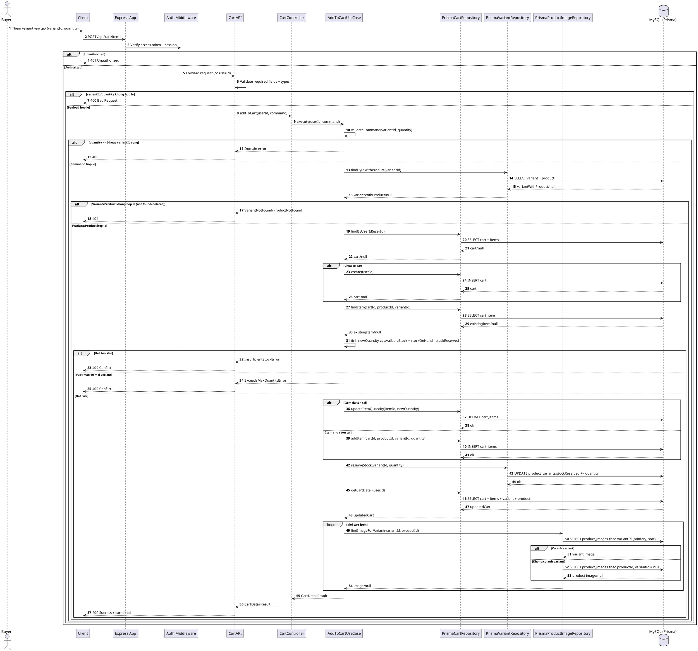
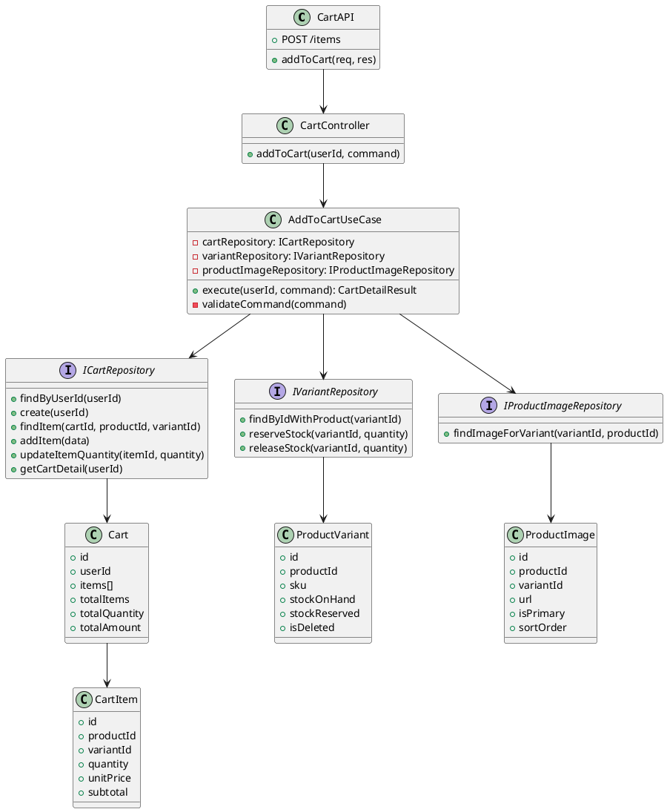

# Sequence - Them Variant Vao Gio Hang (POST /api/cart/items)

## 1. Pham vi va module

- Chuc nang: Them variant vao gio hang.
- Module backend: `server/src/module/cart`.
- Entry route: `POST /api/cart/items` (router cart).
- Auth: duoc bao ve boi auth middleware tai cap app (`/api/cart`).

## 2. Database lien quan (schema.prisma)

- `Cart`: moi user co 1 cart (`userId` unique).
- `CartItem`: luu item theo bo ba (`cartId`, `productId`, `variantId`) voi unique constraint.
- `ProductVariant`: nguon gia va ton kho (`stockOnHand`, `stockReserved`).
- `Product`: dung de xac thuc product cha chua bi xoa mem (`isDeleted`).
- `ProductImage`: anh variant uu tien, fallback anh product (`variantId = null`).

## 3. Sequence (theo luong code hien tai) - PlantUML

## 4. Class diagram (rut gon cho Add to Cart) - PlantUML

## 5. Ghi chu business

- Rule variant-first da duoc enforce trong use case va API (`variantId` bat buoc).
- Max quantity hien tai la 10 item/variant.
- Luong hien tai chua bao transaction bao quanh cap nhat cart item + reserve stock.
- Chuc nang nay chua phat su kien RabbitMQ; dang la luong dong bo trong cart module.
