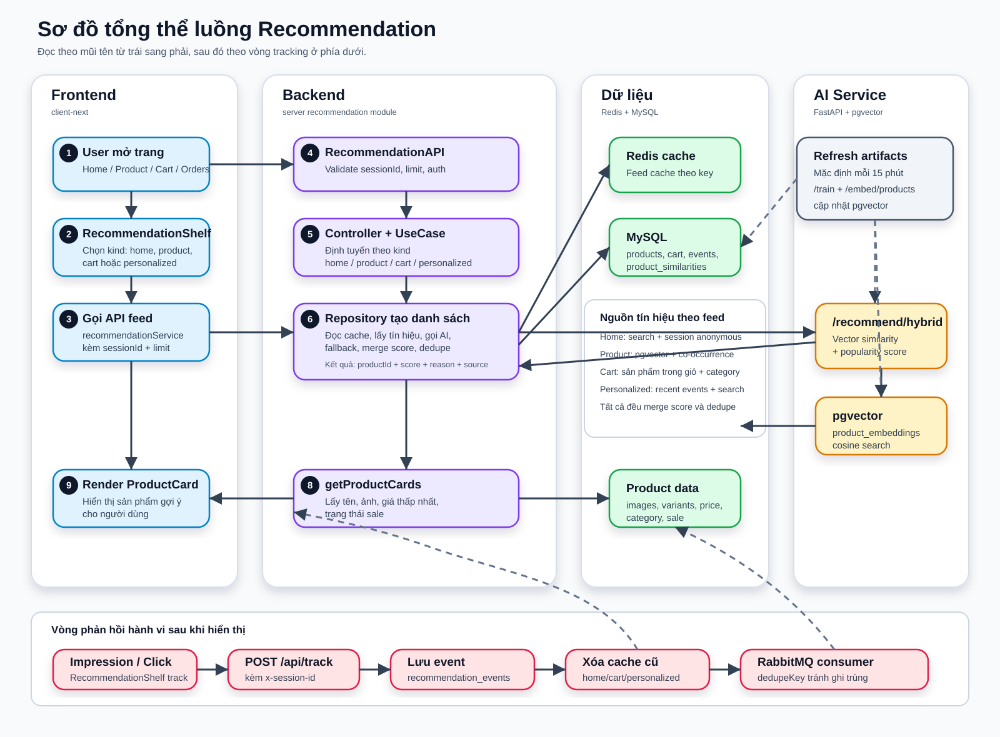

# Giải thích flow recommendation

Tài liệu này mô tả flow recommendation đang được triển khai trong repo, dựa trên code ở `client-next`, `server` và `ai-service`.

## 1. Tổng quan kiến trúc

Hệ thống recommendation gồm 3 lớp chính:

1. **Frontend `client-next`**
   - Hiển thị block gợi ý bằng `RecommendationShelf`.
   - Gọi API recommendation qua React Query.
   - Gửi tracking event cho impression/click và các hành vi mua sắm.

2. **Backend `server`**
   - Expose API dưới prefix `/api`.
   - Validate `sessionId`, `limit`, auth.
   - Chọn loại feed: `home`, `product`, `cart`, `personalized`.
   - Lấy dữ liệu recommendation từ Prisma/MySQL, Redis cache, AI service.
   - Lưu tracking event vào `recommendation_events`.
   - Refresh artifact định kỳ: `product_similarities`, cache, embedding/AI artifacts.

3. **AI service `ai-service`**
   - FastAPI service.
   - Nhận catalog + event từ backend qua `/train` và `/embed/products`.
   - Tạo embedding sản phẩm bằng `sentence-transformers/all-MiniLM-L6-v2` nếu load được, fallback sang hashing embedding.
   - Lưu/search vector trong PostgreSQL + pgvector.
   - Trả về gợi ý hybrid từ vector similarity + popularity qua `/recommend/hybrid`.

Flow rút gọn:

```text
UI RecommendationShelf
  -> client recommendationService
  -> GET /api/recommendations/...
  -> RecommendationAPI
  -> RecommendationController
  -> GetRecommendationFeedUseCase
  -> PrismaRecommendationRepository
  -> Redis cache / MySQL / AI service
  -> product cards
  -> UI render ProductCard
  -> trackingService.track impression/click
  -> POST /api/track
  -> recommendation_events + RabbitMQ + cache invalidation
```

## 1.1 Sơ đồ hình vẽ tổng thể luồng recommendation



Cách đọc sơ đồ:

- Đọc luồng chính từ trái sang phải: Frontend -> Backend -> Dữ liệu/AI -> quay lại Frontend.
- Các ô màu xanh dương là frontend.
- Các ô màu tím là backend recommendation module.
- Các ô màu xanh lá là Redis/MySQL.
- Các ô màu vàng là AI service và pgvector.
- Khung màu hồng phía dưới là vòng phản hồi hành vi: user thấy/click gợi ý -> tracking -> lưu event -> xóa cache cũ -> request sau cá nhân hóa tốt hơn.
- Khung refresh artifacts ở bên phải là tiến trình chạy nền, mặc định 15 phút một lần, dùng để cập nhật `product_similarities` và embedding trong pgvector.

## 2. Các điểm hiển thị trên frontend

Component dùng chung là `client-next/components/page/recommendation-shelf.tsx`.

`RecommendationShelf` nhận các prop quan trọng:

- `kind`: `home`, `product`, `cart`, `personalized`.
- `productId`: bắt buộc với `kind="product"`.
- `limit`: mặc định 8.
- `placement`: vị trí hiển thị, được gửi kèm tracking.
- `enabled`: bật/tắt query.
- `emptyMessage`: thông báo khi feed rỗng.

Các vị trí đang dùng:

- Trang home: `client-next/app/page.tsx`
  - Nếu đã đăng nhập: `kind="personalized"`, placement `home_personalized_recommendations`.
  - Nếu guest: `kind="home"`, placement `home_recommendations`.
- Trang chi tiết sản phẩm: `client-next/components/page/product/product-detail-content.tsx`
  - `kind="product"`, có `productId`, placement `product_detail_recommendations`.
- Trang giỏ hàng: `client-next/app/(page)/cart/page.tsx`
  - Chỉ hiển thị khi authenticated.
  - `kind="cart"`, placement `cart_recommendations`.
- Trang đơn hàng: `client-next/app/(page)/orders/orders-list-client.tsx`
  - Chỉ hiển thị khi authenticated.
  - `kind="personalized"`, placement `orders_personalized_recommendations`.
- Trang thank you sau checkout: `client-next/app/(page)/checkout/thank-you/thank-you-client.tsx`
  - Dùng `kind="personalized"`.

## 3. Session và query key trên frontend

Session id được quản lý trong `client-next/lib/session-id.ts`.

- Key localStorage: `aura_session_id`.
- Nếu browser đã có session id thì reuse.
- Nếu chưa có thì tạo bằng `crypto.randomUUID()` hoặc fallback `sess_${timestamp}_${random}`.
- Khi server render thì trả về chuỗi fallback `server-render-session`.

API recommendation luôn gửi `sessionId` bằng query param:

```text
GET api/recommendations/home?limit=8&sessionId=<session>
GET api/recommendations/product/:id?limit=8&sessionId=<session>
GET api/recommendations/cart?limit=8&sessionId=<session>
GET api/recommendations/personalized?limit=10&sessionId=<session>
```

React Query hooks nằm ở `client-next/hooks/use-recommendations.ts`.

Query key có version `v2` để tránh dùng lại cache cũ:

- Home: `["recommendations", "v2", "home", sessionId, limit]`
- Product: `["recommendations", "v2", "product", productId, sessionId, limit]`
- Cart: `["recommendations", "v2", "cart", user/guest marker, sessionId, limit]`
- Personalized: `["recommendations", "v2", "personalized", user/guest marker, sessionId, limit]`

Cart và personalized chỉ enabled khi user đã authenticated. Home và product có thể public.

## 4. API layer trên backend

Recommendation module được mount trong `server/src/app.ts`:

```text
app.use('/api', createRecommendationModule())
```

Routes nằm trong `server/src/module/recommendation/infrastructure/api/recommendation.api.ts`:

- `POST /api/track`
- `GET /api/recommendations/home`
- `GET /api/recommendations/product/:id`
- `GET /api/recommendations/cart`
- `GET /api/recommendations/personalized`
- `GET /api/analytics/recommendations`

Middleware auth cho phép public:

- `GET /api/recommendations/home`
- `GET /api/recommendations/product/:id`
- `POST /api/track`

Với public tracking, middleware cố gắng attach optional `userId` nếu request có bearer token hợp lệ. Cart và personalized bắt buộc có `req.userId`, nếu không sẽ trả lỗi `Authentication required`.

API validate:

- `sessionId` bắt buộc qua `x-session-id`, query `sessionId`, hoặc body `sessionId`; độ dài sau trim tối thiểu 4.
- `limit` phải là integer từ 1 đến 30.
- `eventType` tracking chỉ nhận các giá trị:
  - `VIEW_PRODUCT`
  - `ADD_TO_CART`
  - `REMOVE_FROM_CART`
  - `PURCHASE`
  - `SEARCH_QUERY`
  - `FAVORITE_PRODUCT`

## 5. Controller và usecase

`RecommendationController` gắn request API sang `GetRecommendationFeedUseCase`.

Mapping:

- `getHome(sessionId, limit)` -> `{ kind: "home", sessionId, limit }`
- `getProduct(productId, sessionId, limit)` -> `{ kind: "product", productId, sessionId, limit }`
- `getCart(userId, sessionId, limit)` -> `{ kind: "cart", userId, sessionId, limit }`
- `getPersonalized(userId, sessionId, limit)` -> `{ kind: "personalized", userId, sessionId, limit }`

`GetRecommendationFeedUseCase` chọn repository method theo `kind`, sau đó gọi `getProductCards(items)` để biến danh sách `{ productId, score, reason, source }` thành card UI.

Title và strategy trả về frontend:

| Kind | Title | Strategy |
| --- | --- | --- |
| `home` | `Xu hướng nổi bật` | `trending+top_viewed+top_purchased` |
| `product` | `Bạn có thể cũng thích` | `item_similarity+category_fallback` |
| `cart` | `Phối cùng giỏ hàng của bạn` | `cart_ai+category_fallback+cross_sell` |
| `personalized` | `Dành riêng cho bạn` | `recent_behavior+hybrid` |

Kết quả response có dạng:

```ts
{
  title: string;
  strategy: string;
  generatedAt: string;
  items: Array<ProductCard & {
    score: number;
    reason: string;
    source: string;
  }>;
}
```

## 6. Repository: flow tạo từng loại feed

Logic chính nằm trong `server/src/module/recommendation/infrastructure/repositories/prisma-recommendation.repository.ts`.

### 6.1 Home recommendations

Method: `getHomeRecommendations(limit, sessionId)`

Cache key:

```text
recommendations:home:v2:{sessionId}:{limit}
```

TTL: 900 giây.

Flow:

1. Đọc Redis cache. Nếu có cache hợp lệ thì trả về.
2. Lấy search intent trong 30 ngày gần nhất cho session anonymous:
   - Chỉ lấy event `SEARCH_QUERY`.
   - Nếu `anonymousSessionOnly=true` thì điều kiện session phải có `user_id IS NULL`.
   - Tìm product có `name` hoặc `description` match query.
   - Score xấp xỉ: `total_search_count * 3 - rankPenalty`.
3. Lấy event trong session 14 ngày gần nhất:
   - Chỉ lấy `VIEW_PRODUCT`, `ADD_TO_CART`, `FAVORITE_PRODUCT`.
   - Chỉ lấy `user_id IS NULL`, để guest session không bị trộn với user đã login.
   - Weight:
     - `ADD_TO_CART`: 3
     - `FAVORITE_PRODUCT`: 2.5
     - `VIEW_PRODUCT`: 1
     - Khác: 0.5
4. Merge search intent + session behavior bằng `mergeRecommendationScores`.
5. Nếu có item thì cache và trả về.
6. Nếu không có tín hiệu thì fallback sang sản phẩm mới/nổi bật:
   - Product không bị delete.
   - Có image.
   - Sắp xếp `isSale desc`, `createdAt desc`.
   - Reason: `Sản phẩm mới nổi bật`.
   - Source: `home_catalog_fallback`.

Ghi chú: strategy trả ra là `trending+top_viewed+top_purchased`, nhưng code hiện tại ưu tiên session/search intent rồi fallback catalog; Redis key global `recommendations:home:global:12` được refresh artifacts tạo ra nhưng feed home đang đọc key theo session.

### 6.2 Product recommendations

Method: `getProductRecommendations(productId, limit)`

Cache key:

```text
recommendations:product:{productId}:{limit}
```

TTL: 1800 giây.

Flow:

1. Đọc Redis cache.
2. Lấy item similarity từ bảng `product_similarities`:
   - Điều kiện `product_id = productId`.
   - Sắp xếp `score desc`.
   - Limit `limit * 2`.
   - Thường được tạo từ co-occurrence trong order items.
3. Gọi AI vector recommendation:
   - Context: `[productId]`.
   - Endpoint: `POST {AI_SERVICE_URL}/recommend/hybrid`.
   - Feed: `product`.
   - Item trả về được gắn:
     - Reason: `Tương đồng bằng pgvector` hoặc `Tương đồng embedding từ pgvector`.
     - Source: `pgvector`.
4. Lấy fallback cùng danh mục/cùng product type:
   - Cùng category trực tiếp, category cha, category con.
   - Nếu chưa đủ thì lấy cùng `productTypeId`.
5. Merge các nguồn:
   - AI vector.
   - `product_similarities`.
   - category/product type fallback.
6. Gọi `uniqueTop(..., excluded=[productId])` để loại sản phẩm đang xem và dedupe.
7. Cache và trả về.

### 6.3 Cart recommendations

Method: `getCartRecommendations(userId, limit)`

Cache key:

```text
recommendations:cart:{userId}:{limit}
```

TTL: 600 giây.

Flow:

1. Đọc Redis cache.
2. Lấy cart theo `userId` kèm `items`.
3. Nếu cart rỗng thì trả về `[]`.
4. Tạo danh sách excluded là product id trong giỏ.
5. Gọi AI vector recommendation:
   - Context là các sản phẩm trong giỏ.
   - Excluded cũng là các sản phẩm trong giỏ.
   - Reason: `AI gợi ý phù hợp với các sản phẩm trong giỏ`.
   - Source: `cart_ai`.
6. Lấy fallback cùng danh mục với các sản phẩm trong giỏ:
   - Reason: `Cùng danh mục với sản phẩm trong giỏ`.
   - Source: `cart_category_fallback`.
7. Lấy product recommendation riêng cho từng item trong giỏ, rồi flatten.
8. Gộp tất cả nguồn, dedupe, loại item đang có trong giỏ.
9. Cache và trả về.

### 6.4 Personalized recommendations

Method: `getPersonalizedRecommendations(userId, sessionId, limit)`

Cache key:

```text
recommendations:personalized:v4:{userId}:{sessionId}:{limit}
```

TTL: 900 giây.

Flow:

1. Đọc Redis cache.
2. Lấy recent events của user trong 45 ngày:
   - Chỉ lấy event có `product_id`.
   - Group theo product.
   - Weight:
     - `PURCHASE`: 4
     - `ADD_TO_CART`: 3
     - `FAVORITE_PRODUCT`: 2.5
     - `VIEW_PRODUCT`: 1
     - Khác: 0.5
   - Vì query đang filter `user_id = userId`, hệ số `* 1.35` luôn áp dụng cho chính user.
   - Limit 10 product context.
3. Lấy search intent theo `userId` trong 30 ngày.
4. Tạo `contextIds` từ recent events.
5. Gọi AI vector recommendation:
   - Context là `contextIds`.
   - Excluded cũng là `contextIds`.
   - Có gửi `user_id` sang AI service.
6. Với mỗi recent product, gọi `getProductRecommendations(productId, max(6, limit))` để lấy item liên quan.
7. Thêm own signals:
   - Product đã tương tác gần đây.
   - Score = event score * 1.2.
   - Reason: `Dựa trên hành vi gần đây của bạn`.
   - Source: `recent_behavior`.
8. Gộp các nguồn:
   - Search intent.
   - Own signals.
   - AI vector.
   - Related product recommendations.
9. `uniqueTop` để dedupe và lấy top `limit`.
10. Cache và trả về.

Lưu ý: personalized hiện tại có thể trả lại sản phẩm user đã tương tác gần đây vì own signals không bị excluded trong bước `uniqueTop`. AI vector thì exclude context ids.

## 7. Scoring và dedupe

Repository có 2 helper quan trọng.

`mergeRecommendationScores(items, limit)`:

- Duyệt danh sách item theo `productId`.
- Nếu product chưa có hoặc item mới có score cao hơn, giữ item mới.
- Nếu product đã có và item mới điểm thấp hơn, cộng thêm `item.score * 0.2` vào item hiện có.
- Sắp xếp `score desc`, cắt theo `limit`.

`uniqueTop(items, limit, excludedProductIds = [])`:

- Loại các product id nằm trong excluded.
- Sắp xếp `score desc`.
- Giữ bản ghi đầu tiên cho mỗi `productId`.
- Cắt theo `limit`.

Vì `uniqueTop` giữ item đầu tiên sau khi sort, reason/source của product sẽ đến từ nguồn có score cao nhất.

## 8. Chuyển product id thành card

Sau khi repository tạo danh sách recommendation item, usecase gọi `getProductCards(items)`.

Method này query bằng `prisma.product.findMany`:

- Chỉ lấy product `isDeleted=false`.
- Lấy:
  - `id`
  - `name`
  - `basePrice`
  - `isSale`
  - variant giá thấp nhất
  - image đầu tiên, ưu tiên `isPrimary desc`, sau đó `sortOrder asc`

Card trả về frontend:

```ts
{
  id,
  name,
  imageUrl,
  minPrice,
  isNew: false,
  isSale,
  score,
  reason,
  source
}
```

Nếu product không tồn tại hoặc đã bị delete thì bị filter khỏi response.

## 9. Tracking flow

Frontend tracking nằm trong `client-next/services/tracking.service.ts`.

Call:

```text
POST /api/track
Header: x-session-id: <session>
Body: {
  eventType,
  productId?,
  orderId?,
  searchQuery?,
  source?,
  placement?,
  occurredAt?,
  dedupeKey?,
  metadata?
}
```

Tracking là fire-and-forget:

- Lỗi API không block UX.
- `occurredAt` mặc định là thời điểm hiện tại.
- `x-session-id` luôn lấy từ `getSessionId()`.

`RecommendationShelf` gửi 2 loại event:

1. **Impression**
   - Trigger khi `items.length > 0`.
   - Event type: `VIEW_PRODUCT`.
   - `source`: `recommendation_impression`.
   - `placement`: prop placement.
   - `metadata.recommendationIds`: danh sách id đang hiện.
   - `metadata.strategy`: strategy feed.
   - Có `impressionKeyRef` để tránh gửi lặp cùng một placement + cùng danh sách item.

2. **Click vào recommendation card**
   - Event type: `VIEW_PRODUCT`.
   - `productId`: item id.
   - `source`: `recommendation_click`.
   - Metadata gồm `reason`, `strategy`, `score`.

Backend `/api/track`:

1. Lấy `sessionId` từ header/query/body.
2. Validate event type.
3. Tạo `dedupeKey`:
   - Nếu client gửi `dedupeKey` hoặc header `x-idempotency-key` thì dùng giá trị đó.
   - Nếu không, build từ `eventType:userId/guest:sessionId:target:occurredAt`.
   - Nếu quá 120 ký tự thì hash SHA-256 thành `trk:<hash>`.
4. Gọi `TrackRecommendationEventUseCase`.
5. Lưu DB qua `saveTrackingEvent`.
6. Publish event vào RabbitMQ.
7. Trả về HTTP 202.

`saveTrackingEvent` insert vào `recommendation_events`:

- `event_type`
- `user_id`
- `session_id`
- `product_id`
- `order_id`
- `search_query`
- `dedupe_key`
- `source`
- `placement`
- `metadata`
- `occurred_at`
- `processed_at`

Nếu trùng unique `dedupe_key`, backend trả `{ accepted: true, duplicated: true }` thay vì throw.

Sau khi lưu event:

- Tăng Prometheus counter `recommendation_events_total`.
- Cập nhật realtime Redis signals:
  - Sorted set `recommendations:hot-products`, weight:
    - `PURCHASE`: 5
    - `ADD_TO_CART`: 3
    - `FAVORITE_PRODUCT`: 2
    - Khác: 1
  - Nếu có `userId` + `productId`, push vào list `recommendations:recent:{userId}`, giữ 30 item, expire 30 ngày.
- Invalidate cache liên quan:
  - Theo session:
    - `recommendations:home:{sessionId}:*`
    - `recommendations:home:v2:{sessionId}:*`
    - `recommendations:personalized:*:{sessionId}:*`
  - Theo user:
    - `recommendations:cart:{userId}:*`
    - `recommendations:personalized:{userId}:*`
    - `recommendations:personalized:v2:{userId}:*`
    - `recommendations:personalized:v3:{userId}:*`
    - `recommendations:personalized:v4:{userId}:*`

## 10. RabbitMQ flow

`recommendation-event-bus.ts` cấu hình:

- Exchange: `recommendation.events`
- Routing key: `tracking.ingest`
- Queue chính: `recommendation_tracking_q`
- Retry queue: `recommendation_tracking_retry_q`
- DLX: `recommendation.events.dlx`
- DLQ: `recommendation_tracking_dlq`
- Retry TTL mặc định: 15000 ms.
- Max retries mặc định: 3.

Khi backend bootstrap recommendation module:

1. Start consumer một lần.
2. Consumer đọc event từ queue.
3. Handler gọi lại `trackEventUseCase.execute(event)`.
4. Nếu thành công thì ack.
5. Nếu lỗi và chưa quá max retries thì đẩy sang retry queue.
6. Nếu quá max retries thì nack để vào DLQ.

Lưu ý quan trọng: `/api/track` hiện tại vừa lưu trực tiếp vào DB, vừa publish RabbitMQ. Consumer sau đó cũng gọi save event. Cơ chế unique `dedupe_key` giúp lần consume thứ hai trở thành duplicated và không tạo bản ghi trùng.

## 11. Refresh artifacts

`server/src/module/recommendation/di.ts` gọi `bootstrapBackgroundWork`.

Background work gồm:

1. Start RabbitMQ consumer.
2. Chạy `refreshUseCase.execute()` ngay khi bootstrap.
3. Lặp lại theo `RECOMMENDATION_REFRESH_INTERVAL_MS`, mặc định 15 phút.

`refreshArtifacts()` làm 3 việc:

### 11.1 Refresh product similarities

Query `order_items` theo co-occurrence:

- Join `order_items` với chính nó theo cùng `order_id`.
- `oi1.product_id <> oi2.product_id`.
- Group theo cặp product.
- Score = `COUNT(*) * 1.0`.
- Xóa các dòng `product_similarities` có `algorithm='cooccurrence'`.
- Insert lại top 500 cặp.

Bảng này được feed product đọc để tạo gợi ý "tương đồng về hành vi mua sắm".

### 11.2 Sync AI artifacts

Lấy tối đa:

- 2000 product không delete.
- 5000 recommendation events gần nhất.

Product payload gửi sang AI:

```json
{
  "product_id": "...",
  "title": "...",
  "description": "...",
  "category": "...",
  "attributes": {
    "tags": ["..."]
  }
}
```

Event payload gửi sang AI:

```json
{
  "user_id": "...",
  "product_id": "...",
  "event_type": "...",
  "weight": 1 | 2 | 3 | 4
}
```

Weight:

- `PURCHASE`: 4
- `ADD_TO_CART`: 3
- `FAVORITE_PRODUCT`: 2
- Khác: 1

Backend gọi:

- `POST /train`
- `POST /embed/products`

### 11.3 Warm cache home global

Tạo fallback item bằng `getLatestProductsFallback(12, 'home_catalog_fallback')`, sau đó persist vào:

```text
recommendations:home:global:12
```

TTL: 3600 giây.

## 12. AI service và pgvector

AI service nằm ở `ai-service/app/main.py`.

Startup:

- Kết nối `VECTOR_DATABASE_URL`.
- Tạo extension `vector`.
- Tạo bảng `product_embeddings` nếu chưa có:
  - `product_id`
  - `title`
  - `category`
  - `embedding vector(384)` mặc định
  - `metadata`
  - `updated_at`
- Tạo index ivfflat cho cosine distance.

### 12.1 `/train`

Nhận `products` và `events`.

Xử lý:

- Lưu product vào in-memory store.
- Tạo vector cho từng product.
- Tính popularity theo event weight.
- Tính `user_preferences[user_id][product_id]` nếu event có user.

Model embedding:

- Ưu tiên `sentence-transformers/all-MiniLM-L6-v2`.
- Nếu không load được thì dùng hashing baseline.

### 12.2 `/embed/products`

Nhận products, tạo embedding, upsert vào bảng `product_embeddings` của vector DB.

Document text để embed gồm:

```text
title + description + category + attributes
```

### 12.3 `/recommend/hybrid`

Request từ backend:

```json
{
  "user_id": "...",
  "session_id": null,
  "context_product_ids": ["..."],
  "candidate_product_ids": [],
  "limit": 12
}
```

Flow:

1. Candidate mặc định là tất cả product trong in-memory store.
2. Context bắt đầu từ `context_product_ids`.
3. Nếu có `user_id`, thêm top 8 product trong `user_preferences[user_id]` vào context.
4. Lấy vector của context product.
5. Nếu có context vector:
   - Tính average vector.
   - Normalize.
   - Search pgvector bằng cosine distance.
   - Exclude context product ids.
6. Với mỗi candidate:
   - `vector_score`: điểm similarity từ pgvector.
   - `popularity_score`: `log1p(popularity[product_id])`.
   - `final_score = vector_score * 0.75 + popularity_score * 0.25`.
7. Sort `final_score desc`, cắt theo `limit`.
8. Trả về:

```json
{
  "generated_at": "...",
  "strategy": "pgvector_hybrid_content_popularity",
  "items": [
    {
      "product_id": "...",
      "score": 0.123,
      "vector_score": 0.1,
      "popularity_score": 0.2
    }
  ]
}
```

Backend chỉ dùng `product_id` và `score`, rồi gắn reason/source theo feed.

## 12.4 Phân tích chi tiết quá trình "train AI"

Trong hệ thống này, chữ **train AI** cần hiểu chính xác là: backend định kỳ gửi dữ liệu sản phẩm và dữ liệu hành vi sang AI service để AI service xây lại bộ nhớ gợi ý. Nó không fine-tune lại một neural network lớn. Quá trình train gồm 3 việc chính:

1. Tạo vector embedding cho nội dung sản phẩm.
2. Tính độ phổ biến của sản phẩm từ hành vi người dùng.
3. Tính sở thích gần đúng của từng user từ lịch sử tương tác.

Luồng tổng quát:

```text
Backend refreshArtifacts
  -> lấy products từ MySQL
  -> lấy recommendation_events gần nhất từ MySQL
  -> POST /train sang AI service
  -> AI service tạo product_vectors, popularity, user_preferences trong RAM
  -> POST /embed/products sang AI service
  -> AI service upsert embedding vào PostgreSQL pgvector
  -> Khi cần gợi ý: backend gọi /recommend/hybrid
```

### 12.4.1 Backend chuẩn bị dữ liệu train

Quá trình bắt đầu từ `refreshArtifacts()` trong `PrismaRecommendationRepository`.

Hàm này được gọi:

- Một lần khi recommendation module bootstrap.
- Lặp lại theo `RECOMMENDATION_REFRESH_INTERVAL_MS`, mặc định 15 phút.

Backend lấy 2 nhóm dữ liệu:

### Nhóm 1: Product catalog

Backend query tối đa 2000 sản phẩm chưa bị xóa:

```ts
this.prisma.product.findMany({
  where: { isDeleted: false },
  select: {
    id: true,
    name: true,
    description: true,
    categories: {
      where: { isPrimary: true },
      take: 1,
      select: { category: { select: { name: true } } },
    },
    tags: { select: { tag: { select: { name: true } } } },
  },
  take: 2000,
})
```

Sau đó map thành payload gửi sang AI:

```json
{
  "product_id": "product-id",
  "title": "Tên sản phẩm",
  "description": "Mô tả sản phẩm",
  "category": "Danh mục chính",
  "attributes": {
    "tags": ["tag 1", "tag 2"]
  }
}
```

Ý nghĩa:

- `title`: tín hiệu mạnh nhất để hiểu sản phẩm là gì.
- `description`: bổ sung ngữ cảnh, chất liệu, kiểu dáng, phong cách.
- `category`: giúp sản phẩm cùng nhóm dễ gần nhau hơn trong vector space.
- `tags`: thêm thuộc tính như style, dịp mặc, chất liệu, màu, form nếu hệ thống có tag.

### Nhóm 2: Recommendation events

Backend query tối đa 5000 event mới nhất:

```sql
SELECT
  user_id as userId,
  product_id as productId,
  event_type as eventType
FROM recommendation_events
ORDER BY occurred_at DESC
LIMIT 5000
```

Sau đó map event thành weight:

| Event | Weight |
| --- | ---: |
| `PURCHASE` | 4 |
| `ADD_TO_CART` | 3 |
| `FAVORITE_PRODUCT` | 2 |
| Khác, ví dụ `VIEW_PRODUCT` | 1 |

Payload gửi sang AI:

```json
{
  "user_id": "user-id",
  "product_id": "product-id",
  "event_type": "ADD_TO_CART",
  "weight": 3
}
```

Ý nghĩa weight:

- Mua hàng là tín hiệu mạnh nhất vì user thật sự chốt sản phẩm.
- Thêm vào giỏ là tín hiệu quan tâm cao.
- Yêu thích là tín hiệu quan tâm vừa.
- Xem sản phẩm là tín hiệu nhẹ vì user có thể chỉ lướt qua.

### 12.4.2 AI service nhận `/train`

Endpoint:

```text
POST /train
```

Input:

```py
class TrainRequest(BaseModel):
    products: list[ProductDocument]
    events: list[UserEvent] = Field(default_factory=list)
```

Khi nhận request, AI service chạy hàm `train()`:

```py
def train(self, request: TrainRequest) -> dict[str, Any]:
    self.products = {product.product_id: product for product in request.products}
    self.product_vectors = {}
    self.user_preferences = defaultdict(Counter)
    self.popularity = Counter()

    for product in request.products:
        self.product_vectors[product.product_id] = self._embed_text(self._document_text(product))

    for event in request.events:
        if event.product_id:
            self.popularity[event.product_id] += max(1.0, event.weight)
        if event.user_id and event.product_id:
            self.user_preferences[event.user_id][event.product_id] += max(1.0, event.weight)
```

Có 4 cấu trúc dữ liệu quan trọng được tạo lại:

### `self.products`

Lưu toàn bộ product document theo `product_id`.

Ví dụ:

```py
{
  "p01": ProductDocument(title="Áo sơ mi trắng", category="Áo sơ mi", ...)
}
```

Mục đích:

- Biết danh sách candidate sản phẩm có thể gợi ý.
- Lấy metadata sản phẩm khi cần tính vector hoặc filter.

### `self.product_vectors`

Lưu embedding vector của từng sản phẩm.

Ví dụ:

```py
{
  "p01": [0.012, -0.031, 0.044, ...]
}
```

Mục đích:

- Biểu diễn nội dung sản phẩm thành vector số.
- Sản phẩm có nội dung/phong cách gần nhau thì vector thường gần nhau.

### `self.popularity`

Đếm điểm phổ biến của từng sản phẩm từ event.

Ví dụ user tương tác:

```text
p01: VIEW_PRODUCT -> +1
p01: ADD_TO_CART  -> +3
p01: PURCHASE     -> +4
```

Thì:

```py
self.popularity["p01"] = 8
```

Mục đích:

- Giúp sản phẩm được nhiều người quan tâm có điểm cộng.
- Tránh chỉ dựa vào nội dung giống nhau mà bỏ qua sản phẩm đang hot.

### `self.user_preferences`

Đếm sở thích theo từng user.

Ví dụ:

```py
self.user_preferences["u01"] = Counter({
  "p01": 7,
  "p05": 3,
  "p09": 1
})
```

Mục đích:

- Khi recommend cho user `u01`, AI service có thể lấy các sản phẩm user từng tương tác mạnh làm context.
- Đây là dạng personalization đơn giản dựa trên implicit feedback.

### 12.4.3 AI tạo embedding sản phẩm như thế nào?

Trước khi embed, AI service ghép product thành một đoạn text:

```py
def _document_text(self, product: ProductDocument) -> str:
    return " ".join(
        [
            product.title,
            product.description,
            product.category or "",
            " ".join(f"{key} {value}" for key, value in product.attributes.items()),
        ]
    ).strip()
```

Ví dụ sản phẩm:

```json
{
  "title": "Áo sơ mi trắng form rộng",
  "description": "Chất cotton thoáng, phù hợp đi làm và đi chơi",
  "category": "Áo sơ mi",
  "attributes": {
    "tags": ["basic", "office", "minimal"]
  }
}
```

Text đem đi embed sẽ gần giống:

```text
Áo sơ mi trắng form rộng Chất cotton thoáng, phù hợp đi làm và đi chơi Áo sơ mi tags ['basic', 'office', 'minimal']
```

Sau đó `_embed_text()` tạo vector:

```py
def _embed_text(self, text: str) -> np.ndarray:
    self._load_encoder()
    if self.encoder is not None:
        vector = self.encoder.encode(text, normalize_embeddings=True)
        return np.array(vector, dtype=float)
    return self._hash_embed(text)
```

Có 2 trường hợp:

### Trường hợp 1: Load được SentenceTransformer

AI service dùng model:

```text
sentence-transformers/all-MiniLM-L6-v2
```

Model này biến text sản phẩm thành vector semantic. Hai sản phẩm có nghĩa gần nhau sẽ có vector gần nhau, ví dụ:

- "áo sơ mi trắng công sở"
- "áo blouse trắng đi làm"

Hai sản phẩm này có thể gần nhau dù text không trùng hoàn toàn.

### Trường hợp 2: Không load được SentenceTransformer

AI service fallback sang `_hash_embed()`.

Hashing embedding hoạt động đơn giản hơn:

1. Tách text thành token.
2. Hash từng token vào một vị trí trong vector.
3. Cộng tần suất token.
4. Normalize vector.

Ưu điểm:

- Không cần model bên ngoài.
- Chạy được trong môi trường thiếu dependency/model.

Nhược điểm:

- Hiểu nghĩa kém hơn SentenceTransformer.
- Chủ yếu dựa vào token trùng hoặc gần trùng.

### 12.4.4 `/embed/products` lưu vector vào pgvector

Sau `/train`, backend tiếp tục gọi:

```text
POST /embed/products
```

Endpoint này cũng tạo embedding cho từng product, nhưng mục tiêu chính là **lưu vector vào PostgreSQL pgvector**.

AI service upsert vào bảng:

```sql
product_embeddings (
  product_id TEXT PRIMARY KEY,
  title TEXT NOT NULL,
  category TEXT NULL,
  embedding vector(384) NOT NULL,
  metadata JSONB NOT NULL DEFAULT '{}',
  updated_at TIMESTAMPTZ NOT NULL DEFAULT NOW()
)
```

Bảng có index:

```sql
USING ivfflat (embedding vector_cosine_ops)
```

Ý nghĩa:

- `self.product_vectors` dùng trong RAM của AI service.
- `product_embeddings` trong pgvector dùng để search similarity nhanh và bền hơn.
- Khi service restart, bảng vector vẫn còn, nhưng in-memory `products`, `popularity`, `user_preferences` cần được `/train` lại để đầy đủ context.

### 12.4.5 Khi user cần gợi ý, AI recommend như thế nào?

Backend chỉ gọi AI service trong các feed cần similarity:

- Product feed: context là sản phẩm đang xem.
- Cart feed: context là các sản phẩm trong giỏ.
- Personalized feed: context là các sản phẩm user tương tác gần đây.

Request backend gửi:

```json
{
  "user_id": "user-id hoặc null",
  "context_product_ids": ["p01", "p05"],
  "candidate_product_ids": [],
  "limit": 12
}
```

Trong AI service, hàm `recommend()` chạy các bước:

### Bước 1: Xác định candidate

```py
candidate_ids = request.candidate_product_ids or list(self.products.keys())
```

Nếu backend không truyền candidate cụ thể, AI xét tất cả product trong `self.products`.

### Bước 2: Tạo context sản phẩm

```py
context_product_ids = list(dict.fromkeys(request.context_product_ids))
```

Context là các sản phẩm đại diện cho nhu cầu hiện tại.

Ví dụ:

- User đang xem áo sơ mi trắng -> context là áo sơ mi trắng.
- User có áo blazer và quần tây trong giỏ -> context là blazer + quần tây.
- User gần đây mua/vừa xem váy dự tiệc -> context là các sản phẩm đó.

### Bước 3: Bổ sung sở thích user

Nếu request có `user_id`, AI lấy thêm top 8 sản phẩm user từng tương tác mạnh:

```py
if request.user_id:
    context_product_ids.extend(
        [
            product_id
            for product_id, _ in self.user_preferences.get(request.user_id, {}).most_common(8)
            if product_id not in context_product_ids
        ]
    )
```

Ý nghĩa:

- Cùng một sản phẩm đang xem, user khác nhau vẫn có thể nhận gợi ý khác nhau.
- Ví dụ cùng xem "áo sơ mi trắng":
  - User A hay mua đồ công sở -> gợi ý quần tây, blazer.
  - User B hay xem đồ streetwear -> gợi ý jeans, overshirt.

### Bước 4: Tính vector đại diện nhu cầu hiện tại

AI lấy vector của các context product:

```py
context_vectors = [
    self.product_vectors[product_id]
    for product_id in context_product_ids
    if product_id in self.product_vectors
]
```

Sau đó tính average vector:

```py
average_vector = np.mean(context_vectors, axis=0)
norm = np.linalg.norm(average_vector)
if norm > 0:
    average_vector = average_vector / norm
```

Ý nghĩa:

- Nếu context có 1 sản phẩm, vector đại diện gần như chính sản phẩm đó.
- Nếu context có nhiều sản phẩm, average vector biểu diễn "gu/nhiệm vụ hiện tại" của user.
- Ví dụ giỏ có áo sơ mi + blazer + quần tây, vector trung bình sẽ nghiêng về outfit công sở.

### Bước 5: Search sản phẩm tương tự bằng pgvector

AI gọi:

```py
vector_hits = self.vector_store.search_similar(
    average_vector,
    candidate_ids,
    context_product_ids,
    request.limit * 3,
)
```

Query pgvector:

```sql
SELECT
  product_id,
  title,
  category,
  1 - (embedding <=> query_vector) AS similarity
FROM product_embeddings
WHERE product_id nằm trong candidate nếu có
  AND product_id không nằm trong context
ORDER BY embedding <=> query_vector
LIMIT request.limit * 3
```

Trong đó:

- `<=>` là cosine distance của pgvector.
- Distance càng nhỏ nghĩa là càng giống.
- `1 - distance` thành similarity score.
- Context product bị exclude để không gợi ý lại đúng sản phẩm đang xem/đang trong giỏ trong phần AI.

### Bước 6: Kết hợp vector score và popularity score

AI tạo điểm cuối:

```py
vector_score = vector_map.get(product_id, {}).get("score", 0.0)
popularity_score = math.log1p(self.popularity.get(product_id, 0.0))
final_score = (vector_score * 0.75) + (popularity_score * 0.25)
```

Công thức:

```text
final_score = 0.75 * vector_score + 0.25 * popularity_score
```

Ý nghĩa:

- 75% điểm đến từ độ giống nội dung/ngữ cảnh.
- 25% điểm đến từ độ phổ biến.
- `log1p` giúp sản phẩm rất hot không áp đảo hoàn toàn sản phẩm phù hợp về nội dung.

Ví dụ:

| Product | Vector score | Popularity raw | `log1p(popularity)` | Final score |
| --- | ---: | ---: | ---: | ---: |
| Áo sơ mi linen | 0.86 | 10 | 2.40 | 1.245 |
| Áo thun basic hot | 0.40 | 100 | 4.62 | 1.455 |
| Blazer công sở | 0.78 | 20 | 3.04 | 1.345 |

Trong ví dụ này, sản phẩm rất hot có thể vượt lên dù vector không cao. Đây là điểm cần theo dõi nếu muốn recommendation "đúng gu" hơn: có thể giảm trọng số popularity hoặc normalize lại popularity.

### Bước 7: Sort và trả kết quả

AI sort theo `final_score desc` và trả về top `limit`:

```json
{
  "generated_at": "...",
  "strategy": "pgvector_hybrid_content_popularity",
  "items": [
    {
      "product_id": "p10",
      "score": 1.345,
      "vector_score": 0.78,
      "popularity_score": 3.04
    }
  ]
}
```

Backend nhận kết quả này, map lại thành:

```ts
{
  productId: item.product_id,
  score: Number(item.score ?? 0),
  reason: "Tương đồng embedding từ pgvector",
  source: "pgvector"
}
```

Sau đó backend còn merge với các nguồn khác:

- Product feed: thêm `product_similarities` và category fallback.
- Cart feed: thêm same-category fallback và product recommendations từng item trong giỏ.
- Personalized feed: thêm search intent, recent behavior và related products.

Vì vậy sản phẩm cuối cùng user thấy không phải chỉ do AI service quyết định. AI service là một nguồn điểm quan trọng, còn backend là nơi phối hợp nhiều nguồn để ra feed cuối.

## 12.5 Ví dụ cụ thể: từ hành vi user đến sản phẩm gợi ý

Giả sử user `u01` có hành vi:

```text
VIEW_PRODUCT p_ao_so_mi_trang    -> weight 1
ADD_TO_CART  p_quan_tay_den      -> weight 3
PURCHASE     p_blazer_xam        -> weight 4
```

Sau lần refresh artifacts:

1. Backend lấy các event này từ `recommendation_events`.
2. Backend gửi sang `/train`.
3. AI service cập nhật:

```py
self.popularity["p_ao_so_mi_trang"] += 1
self.popularity["p_quan_tay_den"] += 3
self.popularity["p_blazer_xam"] += 4

self.user_preferences["u01"]["p_ao_so_mi_trang"] += 1
self.user_preferences["u01"]["p_quan_tay_den"] += 3
self.user_preferences["u01"]["p_blazer_xam"] += 4
```

Khi user vào home đã đăng nhập:

1. Frontend gọi `GET /api/recommendations/personalized`.
2. Backend lấy recent events của `u01`, thấy các sản phẩm công sở ở trên.
3. Backend gọi AI `/recommend/hybrid` với context gồm các product đó.
4. AI tính average vector của áo sơ mi + quần tây + blazer.
5. pgvector tìm các sản phẩm gần vector công sở đó, ví dụ:
   - giày loafer
   - thắt lưng da
   - áo blouse
   - chân váy bút chì
6. AI cộng thêm popularity.
7. Backend merge thêm search intent/recent behavior/related product.
8. Frontend hiển thị feed "Dành riêng cho bạn".

Kết quả là user có khả năng thấy các sản phẩm phối được với gu công sở đã thể hiện trước đó.

## 12.6 Điểm mạnh và giới hạn của quá trình train hiện tại

Điểm mạnh:

- Dễ hiểu, dễ debug.
- Có kết hợp content-based recommendation và popularity.
- Có personalization thông qua `user_preferences`.
- Có fallback nếu AI service lỗi.
- pgvector giúp tìm sản phẩm tương tự nhanh hơn so với scan thủ công.

Giới hạn:

- `/train` hiện tại rebuild in-memory state, không phải incremental training thật.
- `user_preferences` nằm trong RAM, service restart thì cần backend refresh lại.
- Chưa có negative feedback, ví dụ user bỏ qua nhiều lần hoặc remove khỏi cart.
- Chưa normalize popularity theo thời gian, nên sản phẩm hot cũ có thể giữ lợi thế nếu event window chưa hợp lý.
- Chưa có model học ranking từ click/purchase thực tế; ranking chủ yếu là công thức cố định.
- `candidate_product_ids` thường để rỗng nên AI xét toàn bộ catalog trong in-memory store.
- Nếu SentenceTransformer không load được, hashing fallback sẽ kém khả năng hiểu ngữ nghĩa.

Nếu muốn nâng cấp AI recommendation về sau, có thể cân nhắc:

- Time-decay cho event cũ.
- Tách trọng số theo placement, ví dụ click từ recommendation có thể khác view tự nhiên.
- Normalize popularity score trước khi cộng với vector score.
- Dùng collaborative filtering hoặc two-tower retrieval.
- Train learning-to-rank model từ impression/click/purchase.
- Lưu `user_preferences` vào persistent store thay vì chỉ RAM.

## 13. Cache và persistence

Có 2 nơi lưu cache:

1. **Redis**
   - Dùng để đọc nhanh trong runtime.
   - Key theo feed/user/session/product/limit.
   - TTL tùy feed:
     - Home: 900s.
     - Product: 1800s.
     - Cart: 600s.
     - Personalized: 900s.

2. **MySQL `recommendation_caches`**
   - Lưu song song khi `persistCache`.
   - Có `cache_key`, `model_kind`, `user_id`, `product_id`, `session_id`, `items_json`, `metadata`, `expires_at`.
   - Hiện tại code đọc cache từ Redis, không đọc fallback từ bảng `recommendation_caches`.

`persistCache` map feed sang `RecommendationModelKind`:

- Home -> `TRENDING`
- Product -> `ITEM_SIMILARITY`
- Cart -> `SESSION_BASED`
- Personalized -> `HYBRID`

## 14. Bảng dữ liệu liên quan

Trong Prisma schema:

### `recommendation_events`

Lưu hành vi user/session.

Index chính:

- `[eventType, occurredAt]`
- `[userId, occurredAt]`
- `[productId, occurredAt]`
- `[sessionId, occurredAt]`

`dedupeKey` là unique để tránh event trùng.

### `product_similarities`

Lưu quan hệ sản phẩm tương tự.

Primary key:

```text
(productId, relatedProductId, algorithm)
```

Được refresh từ order co-occurrence và đọc trong feed product.

### `recommendation_caches`

Lưu snapshot cache recommendation theo model kind.

### `product_embeddings`

Trong Prisma schema có model `ProductEmbedding` lưu embedding JSON trên DB chính, nhưng AI service hiện tại tạo bảng riêng `product_embeddings` trong vector DB PostgreSQL với type `vector(384)`. Flow recommendation đang dùng bảng pgvector của AI service.

## 15. Analytics và monitoring

API analytics:

```text
GET /api/analytics/recommendations?fromDate=...&toDate=...
```

Trả về:

- Tổng event.
- Số session unique.
- Số product views.
- Số purchases.
- Breakdown theo event type.
- Top 10 product có nhiều event.

Prometheus metrics trong repository:

- `recommendation_events_total`
- `recommendation_cache_hits_total`
- `recommendation_generation_latency_ms`
- `recommendation_ai_latency_ms`
- `recommendation_ai_fallback_total`

AI service cũng expose `/metrics`:

- `aura_ai_products_total`
- `aura_ai_popularity_events_total`

Grafana dashboard nằm ở `infra/grafana/dashboards/recommendation-overview.json`.

## 16. Luồng end-to-end theo từng case

### Guest vào home

```text
Home page
  -> RecommendationShelf(kind="home")
  -> GET /api/recommendations/home?sessionId=...
  -> backend lấy search/session anonymous signals
  -> nếu chưa có signal thì fallback latest sale/new products
  -> render cards
  -> gửi impression tracking
```

### User đăng nhập vào home

```text
Home page
  -> RecommendationShelf(kind="personalized")
  -> GET /api/recommendations/personalized?sessionId=...
  -> backend lấy recent events của user + search intent + AI vector + related products
  -> render cards
  -> gửi impression tracking
```

### Xem chi tiết sản phẩm

```text
Product detail
  -> RecommendationShelf(kind="product", productId)
  -> GET /api/recommendations/product/:id
  -> backend lấy pgvector similar + cooccurrence + category fallback
  -> exclude sản phẩm đang xem
  -> render cards
  -> click card sẽ track VIEW_PRODUCT source recommendation_click
```

### Xem giỏ hàng

```text
Cart page authenticated
  -> RecommendationShelf(kind="cart")
  -> GET /api/recommendations/cart
  -> backend lấy cart item ids
  -> AI vector theo cart context
  -> same-category fallback
  -> product recommendations cho từng item trong cart
  -> exclude sản phẩm đã có trong giỏ
  -> render cards
```

### Sau khi có interaction mới

```text
trackingService.track(...)
  -> POST /api/track
  -> insert recommendation_events
  -> update Redis hot/recent signals
  -> invalidate cache theo session/user
  -> publish RabbitMQ
  -> consumer consume lại, bị dedupe nếu trùng
  -> lần request recommendation tiếp theo sẽ tính lại feed mới
```

## 17. Các điểm cần lưu ý khi debug

- Nếu recommendation không đổi sau khi click/add-to-cart, kiểm tra Redis key có bị invalidate đúng pattern không.
- Home feed chỉ dùng session anonymous (`user_id IS NULL`) cho session behavior; user đã login nên xem personalized feed thay vì home.
- Cart/personalized yêu cầu auth. Nếu frontend không có token hợp lệ sẽ fail.
- AI service chỉ có context nếu `/train` và `/embed/products` đã được refresh thành công.
- Nếu AI service lỗi, backend fallback về category/cooccurrence/catalog và tăng metric `recommendation_ai_fallback_total`.
- Redis là nguồn đọc cache chính; bảng `recommendation_caches` chủ yếu lưu snapshot/observability.
- `product_similarities` chỉ cập nhật theo interval refresh, không realtime ngay sau order mới.
- Impression event trong `RecommendationShelf` có `eventType=VIEW_PRODUCT` nhưng không có `productId`; danh sách product nằm trong metadata `recommendationIds`.
