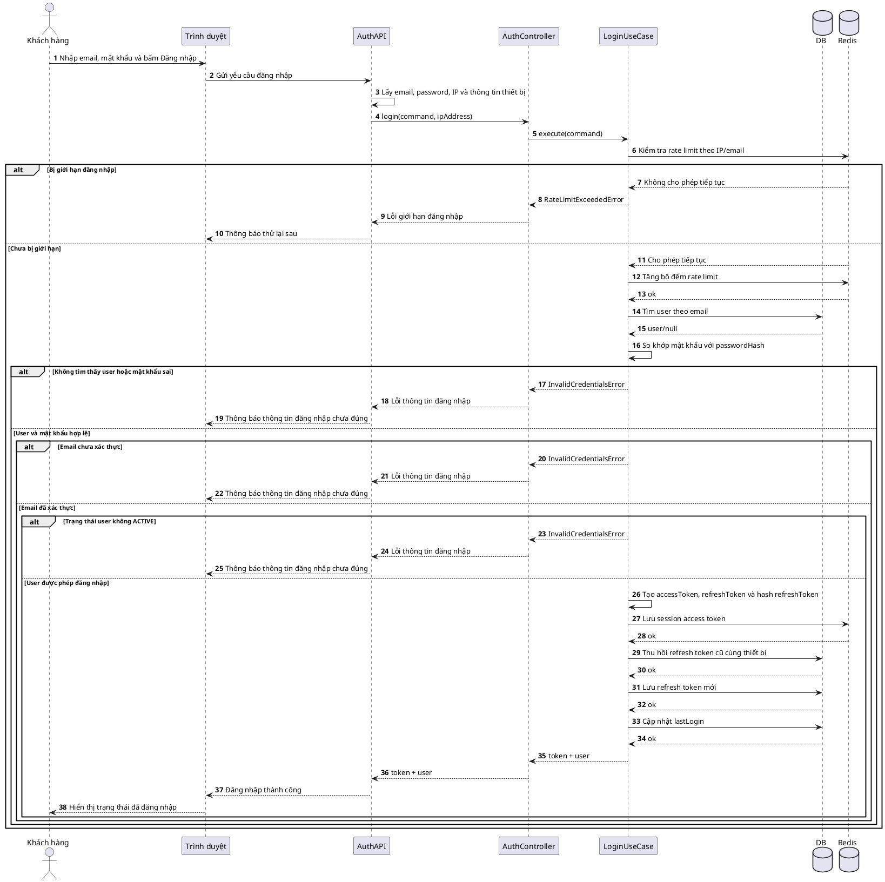

# Sequence - Đăng nhập

## 1. Phạm vi

- Chức năng: Đăng nhập bằng email và mật khẩu.
- Module backend: `server/src/module/auth`.
- Database liên quan: `users`, `refresh_tokens`.
- Redis: kiểm tra giới hạn đăng nhập và lưu session access token.

## 2. Sequence PlantUML

## 3. Ghi chú

- Hệ thống trả lỗi đăng nhập chung cho các trường hợp: sai email/mật khẩu, email chưa xác thực hoặc tài khoản không ở trạng thái `ACTIVE`.
- Access token không lưu vào DB; session access token được lưu ở Redis trong 3600 giây.
- Refresh token được hash trước khi lưu vào `refresh_tokens`.
- Khi đăng nhập trên cùng thiết bị, refresh token cũ chưa thu hồi của thiết bị đó được thu hồi trước khi tạo token mới.
