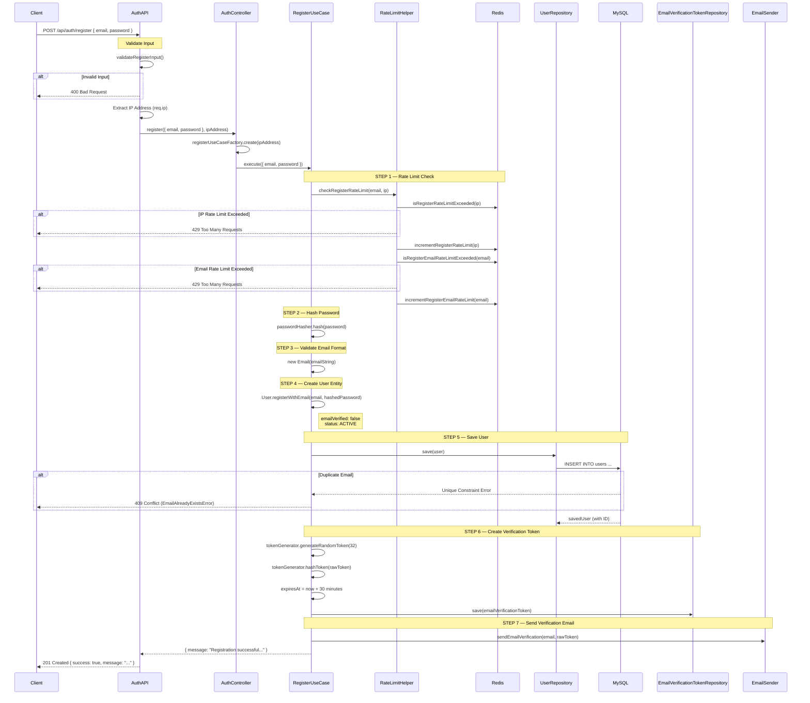

# Register Flow

## Sequence Diagram



---

## Step-by-step Flow

```
Client
  │
  │  POST /api/auth/register
  │  Body: { email, password }
  ▼
┌─────────────────────────────────────────────────┐
│                   AuthAPI                        │
│          infrastructure/api/auth.api.ts          │
│                                                  │
│  [1] validateRegisterInput()                     │
│       ├─ email & password có tồn tại?            │
│       ├─ email đúng format?                      │
│       └─ password >= 6 ký tự?                    │
│                                                  │
│  [2] Extract IP: req.ip                          │
└─────────────────────┬───────────────────────────┘
                      │
                      ▼
┌─────────────────────────────────────────────────┐
│                AuthController                    │
│       interface-adapter/controller               │
│                                                  │
│  registerUseCaseFactory.create(ipAddress)        │
│  → Khởi tạo RegisterUseCase với IP              │
└─────────────────────┬───────────────────────────┘
                      │
                      ▼
┌─────────────────────────────────────────────────┐
│              RegisterUseCase                     │
│          applications/usecases                   │
│                                                  │
│  ┌─ STEP 1: Rate Limit Check (Redis) ─────────┐ │
│  │  RateLimitHelper                           │ │
│  │   ├─ isRegisterRateLimitExceeded(ip)?      │ │
│  │   │    └─ YES → throw RateLimitExceeded    │ │
│  │   ├─ incrementRegisterRateLimit(ip)        │ │
│  │   ├─ isRegisterEmailRateLimitExceeded(     │ │
│  │   │       email)?                          │ │
│  │   │    └─ YES → throw RateLimitExceeded    │ │
│  │   └─ incrementRegisterEmailRateLimit(email)│ │
│  └────────────────────────────────────────────┘ │
│                                                  │
│  STEP 2: Hash Password                           │
│   passwordHasher.hash(password) → hashedPassword │
│                                                  │
│  STEP 3: Validate Email Format                   │
│   new Email(emailString) → Email Value Object    │
│                                                  │
│  STEP 4: Create User Entity                      │
│   User.registerWithEmail(email, hashedPassword)  │
│   → emailVerified: false                         │
│   → status: ACTIVE                               │
└─────────────────────┬───────────────────────────┘
                      │
                      ▼
┌─────────────────────────────────────────────────┐
│              UserRepository.save()               │
│                   → MySQL                        │
│                                                  │
│  ✅  INSERT OK → savedUser (with generated ID)  │
│  ❌  Duplicate email → catch unique constraint   │
│       → throw EmailAlreadyExistsError            │
└─────────────────────┬───────────────────────────┘
                      │ ✅
                      ▼
┌─────────────────────────────────────────────────┐
│          Email Verification Token                │
│                                                  │
│  - generateRandomToken(32)  → rawToken (256-bit) │
│  - hashToken(rawToken)      → tokenHash          │
│  - expiresAt = now + 30 phút                     │
│  - emailVerificationTokenRepository.save(token)  │
└─────────────────────┬───────────────────────────┘
                      │
                      ▼
┌─────────────────────────────────────────────────┐
│                 EmailSender                      │
│   sendEmailVerification(email, rawToken)         │
│   → Gửi email kèm rawToken cho user             │
└─────────────────────┬───────────────────────────┘
                      │
                      ▼
              HTTP 201 Created
              {
                "success": true,
                "message": "Registration successful.
                            Please verify your email."
              }
```

---

## Error Paths

| Bước | Điều kiện lỗi | Error Class | HTTP Status |
|------|---------------|-------------|-------------|
| Validate input | email/password thiếu | `BadRequestError` | `400 Bad Request` |
| Validate input | email sai format | `BadRequestError` | `400 Bad Request` |
| Validate input | password < 6 ký tự | `BadRequestError` | `400 Bad Request` |
| Rate limit | IP vượt giới hạn request | `RateLimitExceededError` | `429 Too Many Requests` |
| Rate limit | Email vượt giới hạn request | `RateLimitExceededError` | `429 Too Many Requests` |
| Save user | Email đã tồn tại trong DB | `EmailAlreadyExistsError` | `409 Conflict` |
| Các bước khác | Lỗi hệ thống không xác định | `InternalServerError` | `500 Internal Server Error` |

---

## Architecture Layers

```
┌──────────────────────────────────────────────────────┐
│  HTTP Layer        AuthAPI                           │
│                    (POST /api/auth/register)          │
├──────────────────────────────────────────────────────┤
│  Controller        AuthController                    │
│                    RegisterUseCaseFactory             │
├──────────────────────────────────────────────────────┤
│  Application       RegisterUseCase                   │
│                    RateLimitHelper                    │
├──────────────────────────────────────────────────────┤
│  Domain            User Entity                       │
│                    Email Value Object                 │
├──────────────────────────────────────────────────────┤
│  Infrastructure    UserRepository       → MySQL      │
│                    RateLimiter          → Redis       │
│                    EmailVerificationRepo → MySQL      │
│                    EmailSender          → SMTP/SES    │
└──────────────────────────────────────────────────────┘
```
